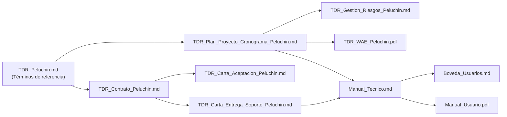

# GESTIÓN DEL PROYECTO — ALBERGUE "PELUCHÍN"

## ÍNDICE GENERAL DE DOCUMENTACIÓN

---

**PROYECTO:** Desarrollo de sitio web y sistema de gestión para el albergue de perritos "Peluchín"

**ORGANIZACIÓN:** Albergue "Peluchín" — ONG sin fines de lucro (Llojeta, La Paz, Bolivia)

**EQUIPO DESARROLLADOR:** Mariana del Arroyo · Nahomi Humerez · Santiago Acha · Jorge Saenz

---

### ORDEN DE LECTURA SUGERIDO

| # | Documento | Contenido |
|---|-----------|-----------|
| 1 | [TDR_Peluchin.md](TDR_Peluchin.md) | Términos de referencia: información general, objetivos, alcance, requerimientos, entregables, pagos y condiciones |
| 2 | [TDR_Plan_Proyecto_Cronograma_Peluchin.md](TDR_Plan_Proyecto_Cronograma_Peluchin.md) | Plan del proyecto: cronograma por sprints, metodología Scrum + Kanban, dependencias y entregables (E1–E11) |
| 3 | [TDR_Contrato_Peluchin.md](TDR_Contrato_Peluchin.md) | Contrato de desarrollo (cláusulas, pagos, propiedad intelectual) |
| 4 | [TDR_Carta_Aceptacion_Peluchin.md](TDR_Carta_Aceptacion_Peluchin.md) | Carta de aceptación del proyecto |
| 5 | [TDR_Gestion_Riesgos_Peluchin.md](TDR_Gestion_Riesgos_Peluchin.md) | Gestión de riesgos: registro detallado, mitigación, contingencia y monitoreo |
| 6 | [TDR_WAE_Peluchin.pdf](TDR_WAE_Peluchin.pdf) | Diagramas WAE (Web Application Extension): mapas de navegación del sitio público y del panel de administración |
| 7 | [TDR_Carta_Entrega_Soporte_Peluchin.md](TDR_Carta_Entrega_Soporte_Peluchin.md) | Carta de entrega y soporte: alcance de garantía, propiedad intelectual y condiciones de soporte |
| 8 | [bitacoras/Bitacora_Sprint_1_Peluchin.md](bitacoras/Bitacora_Sprint_1_Peluchin.md) | Bitácora Sprint 1: instalación, tema y estructura (E1, E2, E3) |
| 9 | [bitacoras/Bitacora_Sprint_2_Peluchin.md](bitacoras/Bitacora_Sprint_2_Peluchin.md) | Bitácora Sprint 2: formularios, donaciones y contenido (E4) |
| 10 | [bitacoras/Bitacora_Sprint_3_Peluchin.md](bitacoras/Bitacora_Sprint_3_Peluchin.md) | Bitácora Sprint 3: panel de administración y funcionalidades avanzadas (E5, E6) |
| 11 | [bitacoras/Bitacora_Sprint_4_Peluchin.md](bitacoras/Bitacora_Sprint_4_Peluchin.md) | Bitácora Sprint 4: QA, despliegue, documentación y capacitación (E7, E8, E9, E10) |

---

### PROFORMAS DE INFRAESTRUCTURA

| Documento | Contenido |
|-----------|-----------|
| [Carta_Entrega_Proformas.md](proformas/Carta_Entrega_Proformas.md) | Carta de entrega de las proformas de infraestructura |
| [Proforma_Dominio_BO_NIC.md](proformas/Proforma_Dominio_BO_NIC.md) | Proforma INF-001: dominio `alberguepeluchin.bo` (NIC Bolivia / ADSIB) |
| [Proforma_Dominio_COM_GoDaddy.md](proformas/Proforma_Dominio_COM_GoDaddy.md) | Proforma INF-002: dominio `alberguepeluchin.com` (GoDaddy) |
| [Proforma_Hosting_WordPress_GoDaddy.md](proformas/Proforma_Hosting_WordPress_GoDaddy.md) | Proforma INF-003: hosting WordPress gestionado (GoDaddy) |
| [Proforma_Hosting_Servidores_Consultora.md](proformas/Proforma_Hosting_Servidores_Consultora.md) | Proforma INF-004: hosting en servidores de la consultora (plan gestionado) |
| [Proforma_Hosting_Bluehost.md](proformas/Proforma_Hosting_Bluehost.md) | Proforma INF-006: hosting compartido WordPress (Bluehost) |
| [Proforma_Hosting_Hostinger.md](proformas/Proforma_Hosting_Hostinger.md) | Proforma INF-007: hosting + constructor web (Hostinger Web Builder) |

---

### MANUALES

| Manual | Contenido |
|--------|-----------|
| [Manual_Tecnico.md](../manuales/Manual_Tecnico.md) | Manual de sistemas (técnico): arquitectura, stack, modelo de datos, seguridad, despliegue, metodología Scrum + Kanban y mantenimiento |
| [Manual_Usuario.pdf](../manuales/Manual_Usuario.pdf) | Manual de usuario: uso del sitio y del panel para el personal del albergue |
| [Boveda_Usuarios.md](../manuales/Boveda_Usuarios.md) | Bóveda de Usuarios y Contraseñas: credenciales confidenciales de todos los componentes del sistema (documento restringido) |

---

### MOCKUP DEL SITIO WEB

Prototipo HTML/CSS/JS del sitio público en [../mockup/](../mockup/):

| Página | Archivo |
|--------|---------|
| Inicio | [index.html](../mockup/index.html) |
| Adopción (galería) | [adopcion.html](../mockup/adopcion.html) |
| Pre-adopción (formulario) | [adoptar.html](../mockup/adoptar.html) |
| Ficha de animal | [ficha.html](../mockup/ficha.html) |
| Donaciones | [donar.html](../mockup/donar.html) |
| Voluntarios | [voluntarios.html](../mockup/voluntarios.html) |
| Blog | [blog.html](../mockup/blog.html) |
| Quiénes Somos | [quienes-somos.html](../mockup/quienes-somos.html) |
| Eventos | [eventos.html](../mockup/eventos.html) |
| FAQ | [faq.html](../mockup/faq.html) |
| Contacto | [contacto.html](../mockup/contacto.html) |
| Error 404 | [404.html](../mockup/404.html) |
| Estilos | [style.css](../mockup/style.css) |
| Scripts | [script.js](../mockup/script.js) |

---

### RELACIÓN ENTRE DOCUMENTOS

---

### RESUMEN DEL PROYECTO

| Concepto | Detalle |
|----------|---------|
| **Plataforma** | Hostinger Web Builder (constructor visual no-code) |
| **Duración total** | 16 semanas (8 de desarrollo + 8 de garantía) |
| **Metodología** | Scrum + Kanban (sprints de 2 semanas con tablero Kanban) |
| **Precio base** | Bs. 12,000 (más IVA) |
| **Entregables** | E1–E11 (ver Plan del Proyecto) |