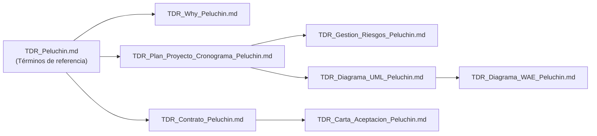

# GESTIÓN DEL PROYECTO — ALBERGUE "PELUCHÍN"

## ÍNDICE GENERAL DE DOCUMENTACIÓN

---

**PROYECTO:** Desarrollo de sitio web y sistema de gestión para el albergue de perritos "Peluchín"

**ORGANIZACIÓN:** Albergue "Peluchín" — ONG sin fines de lucro (Llojeta, La Paz, Bolivia)

**EQUIPO DESARROLLADOR:** Mariana del Arroyo · Nahomi Humerez · Santiago Acha · Jorge Saenz

---

### ORDEN DE LECTURA SUGERIDO

| # | Documento | Contenido |
|---|-----------|-----------|
| 1 | [TDR_Peluchin.md](TDR_Peluchin.md) | Términos de referencia: información general, objetivos, alcance, requerimientos, entregables, pagos y condiciones |
| 2 | [TDR_Why_Peluchin.md](TDR_Why_Peluchin.md) | Justificación del proyecto (Why) |
| 3 | [TDR_Plan_Proyecto_Cronograma_Peluchin.md](TDR_Plan_Proyecto_Cronograma_Peluchin.md) | Plan del proyecto: sprints, dependencias, entregables (E1–E11) y riesgos identificados |
| 4 | [TDR_Contrato_Peluchin.md](TDR_Contrato_Peluchin.md) | Contrato de desarrollo (cláusulas, pagos, propiedad intelectual) |
| 5 | [TDR_Carta_Aceptacion_Peluchin.md](TDR_Carta_Aceptacion_Peluchin.md) | Carta de aceptación del proyecto |
| 6 | [TDR_Gestion_Riesgos_Peluchin.md](TDR_Gestion_Riesgos_Peluchin.md) | Gestión de riesgos: registro detallado, mitigación, contingencia y monitoreo |
| 7 | [TDR_Diagrama_UML_Peluchin.md](TDR_Diagrama_UML_Peluchin.md) | Modelo UML: casos de uso, clases, secuencia, actividad, estados y despliegue |
| 8 | [TDR_Diagrama_WAE_Peluchin.md](TDR_Diagrama_WAE_Peluchin.md) | Diagramas WAE (Web Application Extension): mapas de navegación del sitio público y del panel de administración |

---

### RELACIÓN ENTRE DOCUMENTOS

---

### RESUMEN DEL PROYECTO

| Concepto | Detalle |
|----------|---------|
| **Plataforma** | WordPress (CMS) |
| **Duración total** | 16 semanas (8 de desarrollo + 8 de garantía) |
| **Metodología** | Sprints de 2 semanas |
| **Precio base** | Bs. 12,000 (más IVA) |
| **Entregables** | E1–E11 (ver Plan del Proyecto) |
