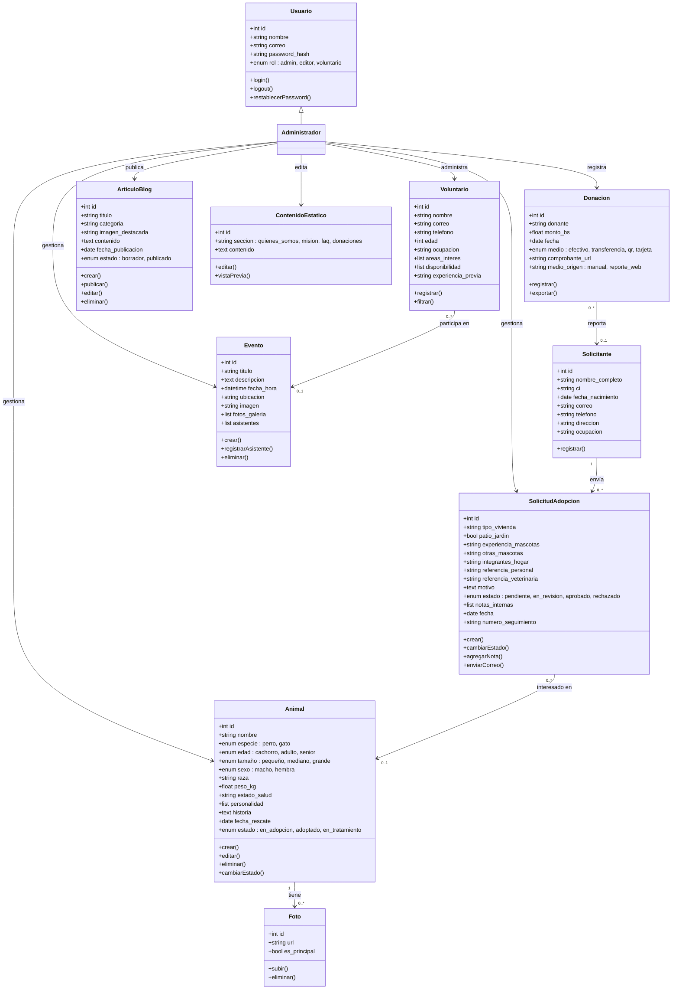
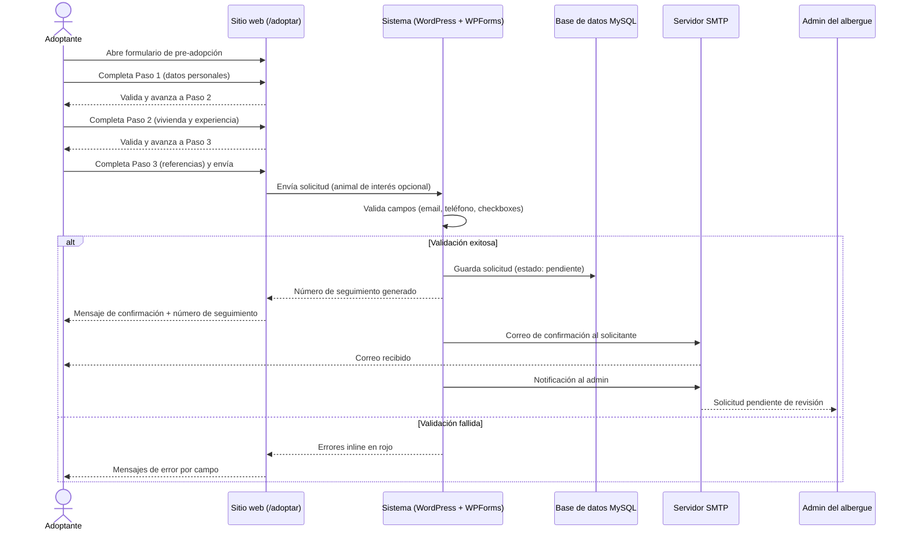
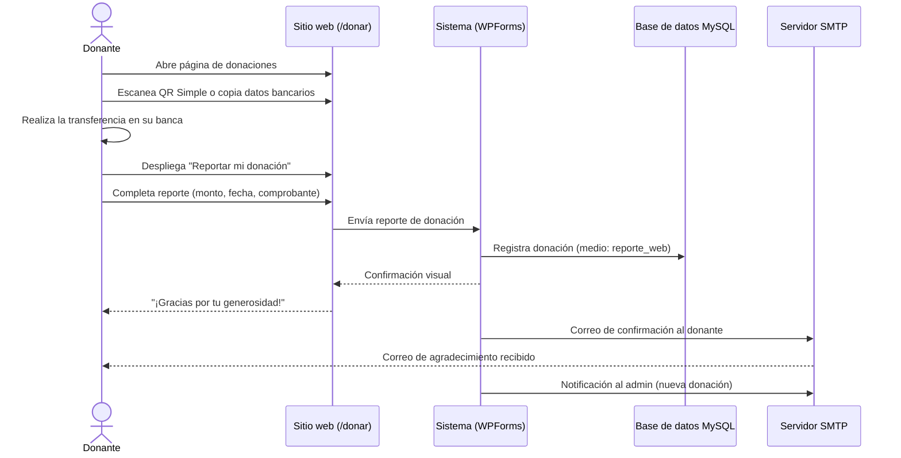
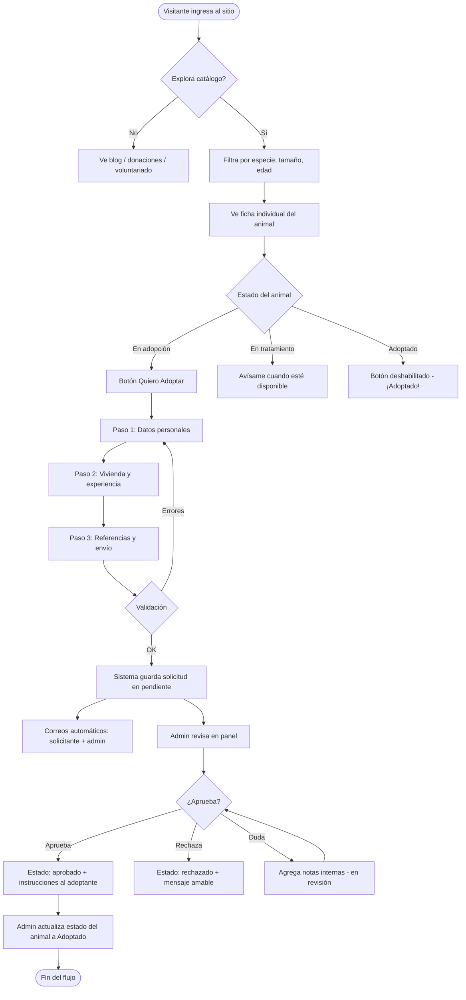
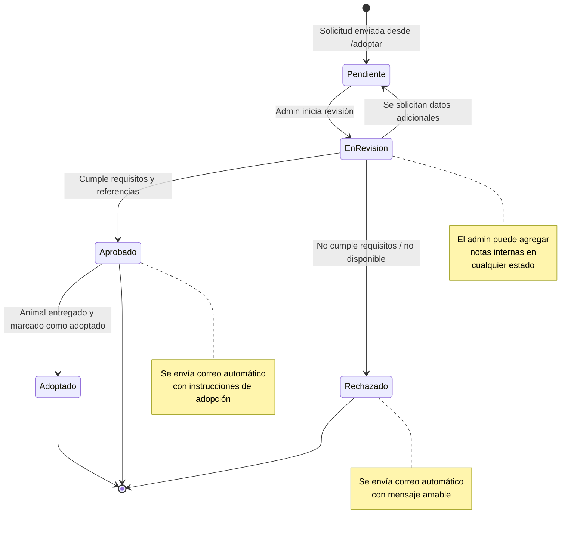
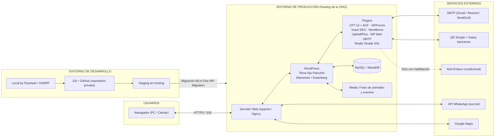

# DIAGRAMA UML DEL PROYECTO

## SITIO WEB Y SISTEMA DE GESTIÓN — ALBERGUE "PELUCHÍN"

---

**FECHA:** [dd/mm/aaaa]

**LUGAR:** La Paz, Estado Plurinacional de Bolivia

**DOCUMENTOS DE REFERENCIA:** TDR_Peluchin.md · TDR_Contrato_Peluchin.md · TDR_Carta_Aceptacion_Peluchin.md

---

---

### 1. ALCANCE DEL MODELO UML

El presente documento modela el sistema **Sitio Web y Sistema de Gestión para el Albergue "Peluchín"** basado en WordPress, conforme a la estructura detallada de páginas, botones y flujos del Contrato (Cláusula 3.1.1) y de la Carta de Aceptación.

**Diagramas incluidos:**
1. Diagrama de casos de uso (actores y funcionalidades).
2. Diagrama de clases (modelo de datos del dominio).
3. Diagrama de secuencia — flujo de pre-adopción.
4. Diagrama de secuencia — flujo de donación.
5. Diagrama de actividad — flujo completo de adopción.
6. Diagrama de estados — ciclo de vida de la solicitud de adopción.
7. Diagrama de componentes y despliegue — stack WordPress.

---

### 2. DIAGRAMA DE CASOS DE USO

#### 2.1. Actores del sistema

| Actor | Tipo | Descripción |
|-------|------|-------------|
| **Visitante** | Primario | Usuario anónimo que navega el sitio público |
| **Adoptante** | Primario | Visitante que se postula para adoptar |
| **Donante** | Primario | Persona que realiza o reporta una donación |
| **Voluntario** | Primario | Persona que se registra para colaborar |
| **Administrador** | Primario | Personal del albergue con acceso al panel (`/admin`) |
| **Editor** | Secundario | Personal del albergue con permisos limitados (blog/contenido) |
| **Sistema** | Secundario | WordPress + plugins: correos, seguridad, backups, notificaciones |
| **Pasarela (Red Enlace)** | Externo | Condicional; solo si la ONG obtiene la habilitación |

#### 2.2. Diagrama

```mermaid
graph TD
    V["👤 Visitante"]
    AD["👤 Adoptante"]
    DO["👤 Donante"]
    VO["👤 Voluntario"]
    A["👤 Administrador"]
    E["👤 Editor"]

    subgraph SITIO_PUBLICO["SITIO PÚBLICO"]
        UC1["Ver landing page"]
        UC2["Explorar catálogo de animales"]
        UC3["Ver ficha individual"]
        UC4["Filtrar por especie/tamaño/edad"]
        UC5["Postular a pre-adopción (3 pasos)"]
        UC6["Reportar donación"]
        UC7["Registrarse como voluntario"]
        UC8["Ver blog y noticias"]
        UC9["Ver eventos y confirmar asistencia"]
        UC10["Contactar / WhatsApp"]
        UC11["Compartir ficha"]
        UC12["Descargar QR / copiar datos bancarios"]
    end

    subgraph PANEL["PANEL DE ADMINISTRACIÓN"]
        UC13["Iniciar sesión"]
        UC14["Ver dashboard KPIs"]
        UC15["CRUD animales"]
        UC16["Gestionar solicitudes de adopción"]
        UC17["Registrar donaciones manuales"]
        UC18["Gestionar voluntarios"]
        UC19["Gestionar blog"]
        UC20["Gestionar eventos"]
        UC21["Configurar contenido estático"]
        UC22["Exportar reportes Excel"]
        UC23["Enviar correos automáticos"]
    end

    V --> UC1
    V --> UC2
    V --> UC8
    V --> UC9
    V --> UC10
    V --> UC11

    AD --> UC2
    AD --> UC3
    AD --> UC5
    AD --> UC6

    DO --> UC12
    DO --> UC6

    VO --> UC7

    A --> UC13
    A --> UC14
    A --> UC15
    A --> UC16
    A --> UC17
    A --> UC18
    A --> UC19
    A --> UC20
    A --> UC21
    A --> UC22

    E --> UC13
    E --> UC19
    E --> UC21

    SIST["⚙️ Sistema"] --> UC23
    SIST --> UC5
    SIST --> UC6
    SIST --> UC7
```

---

### 3. DIAGRAMA DE CLASES (MODELO DE DATOS)

> **Nota de implementación:** En WordPress este modelo se materializa con **CPT UI + ACF** (`Animales`, `Solicitudes`, `Eventos`, `Blog`), roles nativos ampliados con **Members/User Role Editor** y registros de formularios de **WPForms/Contact Form 7**.

---

### 4. DIAGRAMA DE SECUENCIA — FLUJO DE PRE-ADOPCIÓN

---

### 5. DIAGRAMA DE SECUENCIA — FLUJO DE DONACIÓN

---

### 6. DIAGRAMA DE ACTIVIDAD — FLUJO COMPLETO DE ADOPCIÓN

---

### 7. DIAGRAMA DE ESTADOS — SOLICITUD DE ADOPCIÓN

---

### 8. DIAGRAMA DE COMPONENTES Y DESPLIEGUE — STACK WORDPRESS

---

### 9. GLOSARIO DE ENTIDADES Y ESTADOS

| Entidad | Atributos clave | Estados / Enumerados |
|---------|-----------------|----------------------|
| **Animal** | nombre, especie, edad, tamaño, sexo, raza, peso, salud, personalidad, historia, fecha_rescate | en_adopcion · adoptado · en_tratamiento |
| **SolicitudAdopcion** | datos del solicitante, vivienda, referencias, motivo | pendiente · en_revision · aprobado · rechazado |
| **Donacion** | donante, monto, fecha, medio, comprobante | efectivo · transferencia · qr · tarjeta (Red Enlace) |
| **Voluntario** | nombre, correo, áreas de interés, disponibilidad | áreas: paseo · limpieza · veterinaria · difusión · eventos · transporte · captación |
| **ArticuloBlog** | título, categoría, contenido, imagen | borrador · publicado |
| **Evento** | título, fecha_hora, ubicación, galería | próximo · pasado |
| **Usuario** | nombre, correo, password_hash | roles: admin · editor · voluntario |

---

### 10. CIERRE

El presente modelo UML documenta los actores, datos, flujos y componentes del sistema **"Sitio Web y Sistema de Gestión — Albergue Peluchín"**, sirviendo de referencia técnica para el desarrollo, las pruebas funcionales (E7) y la elaboración del Manual de Sistemas (E9). Los diagramas se actualizarán si se incorporan cambios de alcance aprobados mediante adenda (Cláusula Décima Primera del contrato).

---

### ANEXO — COMO RENDERIZAR LOS DIAGRAMAS

| Herramienta | Pasos |
|-------------|-------|
| **GitHub / GitLab** | Subir el `.md` tal cual; los bloques `mermaid` se renderizan automáticamente |
| **mermaid.live** | Copiar cada bloque, pegarlo en [mermaid.live](https://mermaid.live) y exportar como PNG/SVG |
| **VS Code** | Instalar la extensión "Markdown Preview Mermaid Support" y abrir la vista previa |
| **Notion** | Usar el bloque `/code` con lenguaje `mermaid` o pegar la imagen exportada |

