# DIAGRAMAS "WAE" (WEB APPLICATION EXTENSION) — VERSIÓN CORREGIDA
## SITIO WEB Y SISTEMA DE GESTIÓN — ALBERGUE "PELUCHÍN"

---
**FECHA:** [dd/mm/aaaa]
**LUGAR:** La Paz, Estado Plurinacional de Bolivia
**DOCUMENTOS DE REFERENCIA:** TDR_Peluchin.md · TDR_Gestion_Riesgos_Peluchin.md

---

### 0. QUÉ SE CORRIGIÓ Y POR QUÉ

En UML/WAE, `<<link>>`, `<<submit>>` y `<<build>>` **son dependencias**, y toda dependencia estereotipada se dibuja con **línea discontinua** (no continua). Las asociaciones "estructurales" (una página que contiene un formulario, un proceso que agrupa páginas) van con **línea continua**. Los tres diagramas originales mezclaban ambos casos y además usaban la misma figura (rectángulo) para páginas, procesos y formularios, distinguiéndolos solo por color — lo cual no es notación WAE real, es solo un esquema de colores.

Cambios aplicados a los tres diagramas:

1. **Figuras diferenciadas por estereotipo** (no solo color):
   - `<<server page>>` → rectángulo de doble borde (forma "subroutine")
   - `<<client page>>` → forma "stadium" (óvalo alargado)
   - `<<process>>` → hexágono
   - `<<form>>` → paralelogramo
   - `<<external service>>` → forma de bandera/asimétrica
2. **Sentido correcto de `<<submit>>`**: va del **formulario hacia la página que lo procesa**, no del proceso hacia el formulario (como estaba en el original — eso invertía la semántica de "envío").
3. **Se agregó la relación de contención** Página → Formulario (`contiene`, línea continua), que no existía: en el original una página "participaba" de un proceso pero nunca se indicaba qué formulario presentaba realmente.
4. **La agrupación Proceso—Página/Formulario** pasó de flecha dirigida ("participa") a **asociación no dirigida** ("agrupa"), porque un proceso no es el origen ni el destino de un flujo de datos: es un contenedor lógico de páginas y formularios.
5. **Enlaces de navegación faltantes corregidos**: en el mapa público original, `/donar` y `/voluntarios` no eran alcanzables desde ningún `<<link>>` — solo tenían una flecha punteada "participa" hacia su proceso. Se agregaron los enlaces reales desde el menú principal.
6. **`<<build>>` explícito** se añadió donde correspondía (login → dashboard tras autenticación) y se corrigió su estilo a línea discontinua en el diagrama de arquitectura (antes estaba con línea continua).
7. **Relaciones mixtas separadas**: en el diagrama de arquitectura, una sola flecha llevaba `<<link>> / <<submit>>` a la vez, lo cual no es válido — una dependencia tiene un solo estereotipo. Se separaron en dos relaciones distintas.
8. **Estereotipo mal aplicado corregido**: `<<form>>` estaba puesto sobre una relación (Plugins → Red Enlace), cuando `<<form>>` es un estereotipo de **clase/página**, no de relación. Se reemplazó por `<<use>>` (uso condicional de servicio externo).

---

### 1. ALCANCE

El presente documento modela mediante **diagramas `WAE` (Web Application Extension)** la arquitectura y navegación de la plataforma del albergue "Peluchín".

Cada diagrama WAE está compuesto por **cuatro tipos de elementos** (se agrega el cuarto, ausente en la versión original de los mapas 2 y 3, pero necesario para la coherencia con el diagrama 3):

1. **Páginas** (`<<server page>>` / `<<client page>>`): las páginas web que componen la aplicación.
2. **Procesos** (`<<process>>`): los flujos de negocio que agrupan páginas y formularios, y que dan sentido a su navegación.
3. **Formularios** (`<<form>>`): los formularios que capturan y envían información dentro de cada proceso.
4. **Servicios externos** (`<<external service>>`): sistemas fuera del servidor de la ONG con los que la plataforma se integra.

**Notación WAE utilizada:**

| Estereotipo | Figura | Estilo de línea | Descripción |
|-------------|--------|------------------|-------------|
| `<<server page>>` | Rectángulo de doble borde | — | Página construida y ejecutada en el servidor (WordPress/PHP) que genera el HTML de salida. |
| `<<client page>>` | Óvalo alargado (stadium) | — | Resultado renderizado en el navegador del usuario (producido por una `<<server page>>` vía `<<build>>`). |
| `<<process>>` | Hexágono | — | Flujo de negocio que agrupa páginas y formularios (p. ej., proceso de pre-adopción, de donación). |
| `<<form>>` | Paralelogramo | — | Página o sección que presenta un formulario HTML y lo envía a la página del servidor que lo procesa. |
| `<<external service>>` | Bandera / forma asimétrica | — | Servicio de terceros con el que se integra la plataforma. |
| `<<link>>` | — | **Discontinua** | Navegación por hipervínculo entre páginas. |
| `<<submit>>` | — | **Discontinua** | Envío (POST) del formulario hacia la página del servidor. **Va del formulario a la página**, no al revés. |
| `<<build>>` | — | **Discontinua** | Relación por la cual una página del servidor genera la página del cliente que ve el navegador. |
| contiene / agrupa | — | Continua | Asociación estructural: una página contiene un formulario; un proceso agrupa páginas/formularios. |

---

### 2. DIAGRAMA WAE — MAPA DE NAVEGACIÓN DEL SITIO PÚBLICO

```mermaid
flowchart LR
    classDef serverPage fill:#e3f2fd,stroke:#1976d2,stroke-width:2px
    classDef process fill:#fff3e0,stroke:#ef6c00,stroke-width:2px
    classDef form fill:#ede7f6,stroke:#5e35b1,stroke-width:2px

    subgraph PAG["PÁGINAS (<<server page>>)"]
        INICIO[["Inicio\n/"]]
        QS[["Quiénes somos\n/quienes-somos"]]
        CAT[["Catálogo de animales\n/adoptar"]]
        FICHA[["Ficha del animal\n/ficha"]]
        ADOP[["Pre-adopción\n/adopcion"]]
        DON[["Donaciones\n/donar"]]
        VOL[["Voluntarios\n/voluntarios"]]
        BLOG[["Blog\n/blog"]]
        EVE[["Eventos\n/eventos"]]
        CON[["Contacto\n/contacto"]]
        FAQ[["FAQ\n/faq"]]
    end

    subgraph PROC["PROCESOS (<<process>>)"]
        PR1{{"P1 · Pre-adopción\n(3 pasos)"}}
        PR2{{"P2 · Donación y reporte"}}
        PR3{{"P3 · Registro de voluntario"}}
        PR4{{"P4 · Contacto / consulta"}}
    end

    subgraph FOR["FORMULARIOS (<<form>>)"]
        FO1[/"Solicitud de pre-adopción"/]
        FO2[/"Reporte de donación"/]
        FO3[/"Registro de voluntario"/]
        FO4[/"Formulario de contacto"/]
    end

    %% Navegación <<link>> — línea discontinua
    INICIO -.->|"<<link>> menú principal"| CAT
    INICIO -.->|"<<link>>"| QS
    INICIO -.->|"<<link>>"| DON
    INICIO -.->|"<<link>>"| VOL
    INICIO -.->|"<<link>>"| BLOG
    INICIO -.->|"<<link>>"| EVE
    INICIO -.->|"<<link>>"| CON
    INICIO -.->|"<<link>>"| FAQ
    QS -.->|"<<link>>"| FAQ
    CAT -.->|"<<link>> ver ficha"| FICHA
    FICHA -.->|"<<link>> quiero adoptar"| ADOP
    FICHA -.->|"<<link>> WhatsApp / compartir"| CON

    %% Contención página → formulario — línea continua
    ADOP -->|contiene| FO1
    DON -->|contiene| FO2
    VOL -->|contiene| FO3
    CON -->|contiene| FO4

    %% Envío <<submit>> formulario → página que procesa — línea discontinua
    FO1 -.->|"<<submit>>"| ADOP
    FO2 -.->|"<<submit>>"| DON
    FO3 -.->|"<<submit>>"| VOL
    FO4 -.->|"<<submit>>"| CON

    %% Agrupación proceso—página/formulario — asociación no dirigida
    PR1 ---|agrupa| FICHA
    PR1 ---|agrupa| ADOP
    PR2 ---|agrupa| DON
    PR3 ---|agrupa| VOL
    PR4 ---|agrupa| CON
    PR4 ---|agrupa| FAQ

    class INICIO,QS,CAT,FICHA,ADOP,DON,VOL,BLOG,EVE,CON,FAQ serverPage
    class PR1,PR2,PR3,PR4 process
    class FO1,FO2,FO3,FO4 form
```

#### 2.1. Páginas del sitio público

| Página del servidor (`<<server page>>`) | Ruta | Proceso que agrupa | Formulario que contiene (`<<form>>`) | Enlaces `<<link>>` salientes |
|---|---|---|---|---|
| Inicio | `/` | — | — | Quiénes somos, Catálogo, Donaciones, Voluntarios, Blog, Eventos, Contacto, FAQ |
| Quiénes somos | `/quienes-somos` | — | — | FAQ |
| Catálogo de animales | `/adoptar` | — | — | Ficha del animal |
| Ficha del animal | `/ficha` | P1 | — | Pre-adopción; Contacto (WhatsApp/compartir) |
| Pre-adopción | `/adopcion` | P1 | Solicitud de pre-adopción | — |
| Donaciones | `/donar` | P2 | Reporte de donación | — |
| Voluntarios | `/voluntarios` | P3 | Registro de voluntario | — |
| Blog | `/blog` | — | — | Inicio |
| Eventos | `/eventos` | — | — | Inicio |
| Contacto | `/contacto` | P4 | Formulario de contacto | — |
| FAQ | `/faq` | P4 | — | — |

> Corrección: en el original, Donaciones y Voluntarios no tenían ningún `<<link>>` entrante — eran páginas "huérfanas" en la navegación. Ahora ambas son alcanzables desde el menú principal de Inicio.

#### 2.2. Procesos del sitio público

| Proceso (`<<process>>`) | Páginas/formularios que agrupa | Descripción |
|---|---|---|
| P1 · Pre-adopción | Ficha del animal, Pre-adopción, Solicitud de pre-adopción | Solicitud de adopción en 3 pasos: datos personales, vivienda y experiencia, referencias y envío. |
| P2 · Donación y reporte | Donaciones, Reporte de donación | Canal de donación (QR / transferencia) y reporte del donante con comprobante. |
| P3 · Registro de voluntario | Voluntarios, Registro de voluntario | Captación de colaboradores con áreas de interés y disponibilidad. |
| P4 · Contacto / consulta | Contacto, FAQ, Formulario de contacto | Consultas del público, WhatsApp y compartir fichas. |

#### 2.3. Formularios del sitio público

| Formulario (`<<form>>`) | Página que lo contiene | `<<submit>>` procesado por | Resultado del envío |
|---|---|---|---|
| Solicitud de pre-adopción | Pre-adopción `/adopcion` | Pre-adopción (backend PHP/WPForms) | Guarda la solicitud + número de seguimiento + correos |
| Reporte de donación | Donaciones `/donar` | Donaciones (backend PHP/WPForms) | Registra la donación + correo de agradecimiento |
| Registro de voluntario | Voluntarios `/voluntarios` | Voluntarios (backend PHP/WPForms) | Registra el voluntario + notificación al admin |
| Formulario de contacto | Contacto `/contacto` | Contacto (backend PHP/WPForms) | Envía la consulta por correo |

---

### 3. DIAGRAMA WAE — MAPA DE NAVEGACIÓN DEL PANEL DE ADMINISTRACIÓN

```mermaid
flowchart LR
    classDef serverPage fill:#e3f2fd,stroke:#1976d2,stroke-width:2px
    classDef process fill:#fff3e0,stroke:#ef6c00,stroke-width:2px
    classDef form fill:#ede7f6,stroke:#5e35b1,stroke-width:2px

    subgraph PAG["PÁGINAS (<<server page>>)"]
        LOGIN[["Inicio de sesión\n/admin/login"]]
        DASH[["Dashboard KPIs\n/admin"]]
        ANI[["Animales (CRUD)\n/admin/animales"]]
        SOL[["Solicitudes de adopción\n/admin/solicitudes"]]
        DON[["Donaciones\n/admin/donaciones"]]
        VOL[["Voluntarios\n/admin/voluntarios"]]
        BLOG[["Blog (CRUD)\n/admin/blog"]]
        EVE[["Eventos (CRUD)\n/admin/eventos"]]
        CON[["Contenido estático\n/admin/contenido"]]
    end

    subgraph PROC["PROCESOS (<<process>>)"]
        PR1{{"P1 · Autenticación y acceso"}}
        PR2{{"P2 · Gestión de animales"}}
        PR3{{"P3 · Gestión de solicitudes"}}
        PR4{{"P4 · Registro de donaciones"}}
        PR5{{"P5 · Gestión de voluntarios"}}
        PR6{{"P6 · Gestión de contenido"}}
    end

    subgraph FOR["FORMULARIOS (<<form>>)"]
        FO1[/"Credenciales de acceso"/]
        FO2[/"CRUD de animales"/]
        FO3[/"Estado / notas de solicitud"/]
        FO4[/"Registro manual de donación"/]
        FO5[/"Edición de voluntarios"/]
        FO6[/"CRUD blog / eventos / secciones"/]
    end

    %% Contención página → formulario — línea continua
    LOGIN -->|contiene| FO1
    ANI -->|contiene| FO2
    SOL -->|contiene| FO3
    DON -->|contiene| FO4
    VOL -->|contiene| FO5
    BLOG -->|contiene| FO6
    EVE -->|contiene| FO6
    CON -->|contiene| FO6

    %% Envío <<submit>> formulario → página que procesa — línea discontinua
    FO1 -.->|"<<submit>>"| LOGIN
    FO2 -.->|"<<submit>>"| ANI
    FO3 -.->|"<<submit>>"| SOL
    FO4 -.->|"<<submit>>"| DON
    FO5 -.->|"<<submit>>"| VOL
    FO6 -.->|"<<submit>>"| BLOG
    FO6 -.->|"<<submit>>"| EVE
    FO6 -.->|"<<submit>>"| CON

    %% Navegación tras autenticación y menú del panel — <<link>> discontinuo
    LOGIN -.->|"<<link>> tras autenticación exitosa"| DASH
    DASH -.->|"<<link>> menú del panel"| ANI
    DASH -.->|"<<link>>"| SOL
    DASH -.->|"<<link>>"| DON
    DASH -.->|"<<link>>"| VOL
    DASH -.->|"<<link>>"| BLOG
    DASH -.->|"<<link>>"| EVE
    DASH -.->|"<<link>>"| CON
    ANI -.->|"<<link>> volver"| DASH
    SOL -.->|"<<link>> volver"| DASH
    DON -.->|"<<link>> volver"| DASH
    VOL -.->|"<<link>> volver"| DASH
    BLOG -.->|"<<link>> volver"| DASH
    EVE -.->|"<<link>> volver"| DASH
    CON -.->|"<<link>> volver"| DASH

    %% Agrupación proceso—página/formulario — asociación no dirigida
    PR1 ---|agrupa| LOGIN
    PR2 ---|agrupa| ANI
    PR3 ---|agrupa| SOL
    PR4 ---|agrupa| DON
    PR5 ---|agrupa| VOL
    PR6 ---|agrupa| BLOG
    PR6 ---|agrupa| EVE
    PR6 ---|agrupa| CON

    class LOGIN,DASH,ANI,SOL,DON,VOL,BLOG,EVE,CON serverPage
    class PR1,PR2,PR3,PR4,PR5,PR6 process
    class FO1,FO2,FO3,FO4,FO5,FO6 form
```

#### 3.1. Páginas del panel de administración

| Página del servidor (`<<server page>>`) | Ruta | Proceso que agrupa | Formulario que contiene (`<<form>>`) |
|---|---|---|---|
| Inicio de sesión | `/admin/login` | P1 | Credenciales de acceso |
| Dashboard KPIs | `/admin` | — | — |
| Animales | `/admin/animales` | P2 | CRUD de animales |
| Solicitudes de adopción | `/admin/solicitudes` | P3 | Estado / notas de solicitud |
| Donaciones | `/admin/donaciones` | P4 | Registro manual de donaciones |
| Voluntarios | `/admin/voluntarios` | P5 | Edición y filtrado de voluntarios |
| Blog | `/admin/blog` | P6 | CRUD blog / eventos / secciones |
| Eventos | `/admin/eventos` | P6 | CRUD blog / eventos / secciones |
| Contenido estático | `/admin/contenido` | P6 | CRUD blog / eventos / secciones |

#### 3.2. Procesos del panel de administración

| Proceso (`<<process>>`) | Páginas que agrupa | Descripción |
|---|---|---|
| P1 · Autenticación y acceso | Inicio de sesión | Validación de credenciales y apertura del Dashboard. |
| P2 · Gestión de animales | Animales | Alta, edición, cambio de estado y baja de fichas de animales. |
| P3 · Gestión de solicitudes | Solicitudes de adopción | Revisión de solicitudes: pendiente → en revisión → aprobado / rechazado. |
| P4 · Registro de donaciones | Donaciones | Registro manual de donaciones (efectivo, transferencia, QR). |
| P5 · Gestión de voluntarios | Voluntarios | Listado, filtrado y edición de voluntarios. |
| P6 · Gestión de contenido | Blog, Eventos, Contenido estático | CRUD de publicaciones, eventos y secciones estáticas. |

#### 3.3. Formularios del panel de administración

| Formulario (`<<form>>`) | Página que lo contiene | `<<submit>>` procesado por | Resultado del envío |
|---|---|---|---|
| Credenciales de acceso | Inicio de sesión `/admin/login` | Inicio de sesión (valida y redirige) | Ingreso al Dashboard vía `<<link>>` |
| CRUD de animales | Animales `/admin/animales` | Animales | Crear / editar / eliminar / cambiar estado |
| Estado / notas de solicitud | Solicitudes `/admin/solicitudes` | Solicitudes | Cambio de estado + correos al aprobar/rechazar |
| Registro manual de donación | Donaciones `/admin/donaciones` | Donaciones | Registro y exportación de la donación |
| Edición de voluntarios | Voluntarios `/admin/voluntarios` | Voluntarios | Actualización de datos y filtros |
| CRUD blog / eventos / secciones | Blog, Eventos, Contenido `/admin/*` | Cada una procesa su propio envío | Crear / editar / publicar / eliminar |

---

### 4. DIAGRAMA WAE — ARQUITECTURA DEL SISTEMA

```mermaid
flowchart LR
    classDef clientPage fill:#e8f5e9,stroke:#388e3c,stroke-width:2px
    classDef serverPage fill:#e3f2fd,stroke:#1976d2,stroke-width:2px
    classDef process fill:#fff3e0,stroke:#ef6c00,stroke-width:2px
    classDef form fill:#ede7f6,stroke:#5e35b1,stroke-width:2px
    classDef external fill:#fce4ec,stroke:#c62828,stroke-width:2px
    classDef infra fill:#f5f5f5,stroke:#616161,stroke-width:2px

    subgraph PAG["PÁGINAS"]
        NAV(["<<client page>>\nNavegador del usuario\n(PC / Celular)"])
        PUB[["<<server page>>\nSitio público\n/ · /adoptar · /ficha · /donar ..."]]
        ADM[["<<server page>>\nPanel de administración\n/admin"]]
    end

    subgraph PROC["PROCESOS (<<process>>)"]
        PR1{{"Renderizado\n(build PHP)"}}
        PR2{{"Validación y\nregistro"}}
        PR3{{"Notificaciones\npor correo"}}
    end

    subgraph FOR["FORMULARIOS (<<form>>)"]
        FPUB[/"<<form>> públicos\npre-adopción · donación\nvoluntario · contacto"/]
        FADM[/"<<form>> panel\nCRUD · estados · reportes"/]
    end

    subgraph SERVIDOR["SERVIDOR (Hosting de la ONG)"]
        WP["WordPress + Tema hijo\n(PHP)"]
        PLUG["Plugins\nCPT UI + ACF · WPForms\nYoast SEO · Wordfence · SMTP"]
    end

    subgraph MEDIA["MEDIA / ARCHIVOS"]
        MED[("Media\nFotos de animales y eventos")]
    end

    subgraph EXTERNOS["SERVICIOS EXTERNOS"]
        SMTP>"<<external service>>\nSMTP (Gmail / Resend / SendGrid)"]
        QR>"<<external service>>\nQR Simple + datos bancarios"]
        WA>"<<external service>>\nWhatsApp API (wa.me)"]
        RED>"<<external service>>\nRed Enlace (condicional)"]
    end

    %% Navegación del usuario — <<link>> discontinuo
    NAV -.->|"<<link>>"| PUB
    NAV -.->|"<<link>>"| ADM

    %% Construcción de páginas — <<build>> discontinuo
    PUB -.->|"<<build>>"| NAV
    ADM -.->|"<<build>>"| NAV
    PR1 -.->|"<<build>>"| NAV

    %% Contención página → formulario — línea continua
    PUB -->|contiene| FPUB
    ADM -->|contiene| FADM

    %% Envío <<submit>> formulario → proceso que lo procesa — línea discontinua
    FPUB -.->|"<<submit>>"| PR2
    FADM -.->|"<<submit>>"| PR2

    %% Uso del proceso de renderizado — asociación no dirigida
    PUB ---|usa| PR1
    ADM ---|usa| PR1

    %% Flujo interno de datos — línea continua
    PR2 --> WP
    PR2 --> PR3
    PR3 -.->|"<<use>> correos automáticos"| SMTP
    PUB -->|ejecuta en| WP
    ADM -->|ejecuta en| WP
    WP --> PLUG
    WP --> MED

    %% Integraciones externas — <<link>> / <<use>> discontinuo
    PUB -.->|"<<link>> pago / donación"| QR
    PUB -.->|"<<link>> chat / contacto"| WA
    PLUG -.->|"<<use>> solo con habilitación"| RED

    class NAV clientPage
    class PUB,ADM serverPage
    class PR1,PR2,PR3 process
    class FPUB,FADM form
    class SMTP,QR,WA,RED external
    class WP,PLUG,MED infra
```

#### 4.1. Páginas de la arquitectura

| Página | Estereotipo WAE | Rol en el sistema |
|---|---|---|
| Navegador del usuario | `<<client page>>` | Renderiza la página construida por el servidor y captura los envíos (`<<submit>>`) de formularios |
| Sitio público | `<<server page>>` | Páginas del servidor del front (lectura y captura de información) |
| Panel de administración | `<<server page>>` | Páginas del servidor del back (escritura y control de la información) |

#### 4.2. Procesos de la arquitectura

| Proceso (`<<process>>`) | Descripción |
|---|---|
| Renderizado (build PHP) | Proceso que construye (`<<build>>`) la `<<client page>>` a partir de la `<<server page>>` |
| Validación y registro | Proceso que valida los `<<form>>` recibidos por `<<submit>>` y registra la información en WordPress |
| Notificaciones por correo | Proceso que envía correos automáticos (confirmaciones y notificaciones) vía SMTP |

#### 4.3. Formularios de la arquitectura

| Formulario (`<<form>>`) | Página que lo contiene | `<<submit>>` procesado por |
|---|---|---|
| Formularios públicos (pre-adopción, donación, voluntario, contacto) | Sitio público | Proceso de validación y registro |
| Formularios del panel (CRUD, estados, reportes) | Panel de administración | Proceso de validación y registro |

#### 4.4. Componentes de soporte del sistema

| Componente | Tipo | Rol en el sistema |
|---|---|---|
| WordPress + Tema hijo | Componente servidor (infraestructura, no WAE) | Motor PHP que construye (`<<build>>`) las páginas del servidor |
| Plugins | Componente servidor (infraestructura, no WAE) | Funcionalidad (CPT/ACF, formularios, SEO, seguridad, correos SMTP) |
| SMTP | `<<external service>>` | Envío de correos automáticos (confirmaciones y notificaciones) |
| QR Simple / Banca | `<<external service>>` | Canal de donación (reporte y verificación) |
| WhatsApp (wa.me) | `<<external service>>` | Contacto y compartir fichas |
| Red Enlace | `<<external service>>` | Pasarela de pago condicional (solo si la ONG obtiene la habilitación) |

---

### 5. COMPARACIÓN DE LOS MAPAS WAE

| Aspecto | Usuario (sitio público) | Administrador (panel) |
|---|---|---|
| **Tipo de páginas** | Páginas del servidor de solo lectura y captura de información | Páginas del servidor de escritura y control de la información |
| **Acceso** | Público, sin autenticación | Requiere `<<submit>>` de credenciales en `/admin/login`, seguido de `<<link>>` al Dashboard |
| **Procesos (`<<process>>`)** | Pre-adopción, donación, voluntariado, contacto | Autenticación, gestión de animales/solicitudes/donaciones/voluntarios/contenido |
| **Enlaces principales (`<<link>>`)** | Inicio → todas las secciones (incluidas Donaciones y Voluntarios); catálogo → ficha → pre-adopción | Login → Dashboard → módulos de gestión → vuelta al Dashboard |
| **Formularios (`<<form>>`)** | Pre-adopción, donación, voluntariado, contacto — cada uno contenido en su página y con `<<submit>>` hacia esa misma página | CRUD de animales, solicitudes, donaciones, voluntarios, blog/eventos/contenido — mismo patrón contención + `<<submit>>` |
| **Terminación de la sesión** | El usuario cierra el navegador | El administrador cierra sesión o la sesión expira |
