# DIAGRAMAS "WAE" (WEB APPLICATION EXTENSION)

## SITIO WEB Y SISTEMA DE GESTIÓN — ALBERGUE "PELUCHÍN"

---

**FECHA:** [dd/mm/aaaa]

**LUGAR:** La Paz, Estado Plurinacional de Bolivia

**DOCUMENTOS DE REFERENCIA:** TDR_Peluchin.md · TDR_Diagrama_UML_Peluchin.md · TDR_Gestion_Riesgos_Peluchin.md

---

### 1. ALCANCE

El presente documento modela mediante **diagramas `WAE` (Web Application Extension)** la arquitectura y navegación de la plataforma del albergue "Peluchín", aplicando la extensión del Lenguaje de Modelado Unificado (UML) para aplicaciones web.

Los diagramas definen **estereotipos** para representar las páginas del servidor y del cliente, así como las relaciones de navegación entre ellas:

1. **Mapa de navegación WAE del sitio público** (usuario).
2. **Mapa de navegación WAE del panel de administración** (administrador).
3. **Diagrama WAE de la arquitectura del sistema** (vista completa: cliente, servidor, datos y servicios externos).

**Notación WAE utilizada:**

| Estereotipo | Símbolo | Descripción |
|-------------|---------|-------------|
| `<<server page>>` | Página del servidor | Página construida y ejecutada en el servidor (WordPress/PHP) que genera el HTML de salida. |
| `<<client page>>` | Página del cliente | Resultado renderizado en el navegador del usuario (producido por una `<<server page>>` vía `<<build>>`). |
| `<<link>>` | Enlace | Navegación por hipervínculo entre páginas. |
| `<<form>>` | Formulario | Página que presenta un formulario HTML y lo envía a la página del servidor que lo procesa. |
| `<<submit>>` | Envío | Envío (POST) del formulario hacia la página del servidor. |
| `<<build>>` | Construcción | Relación por la cual una página del servidor genera la página del cliente que ve el navegador. |

> **Nota de implementación (WordPress):** al tratarse de renderizado del lado del servidor, cada ruta es una `<<server page>>` que "construye" (`<<build>>`) la `<<client page>>` que el navegador muestra. Por eso los diagramas representan páginas del servidor y sus enlaces/formularios de navegación.

---

### 2. DIAGRAMA WAE — MAPA DE NAVEGACIÓN DEL SITIO PÚBLICO

> Modela la navegación del usuario (visitante/adoptante/donante/voluntario) entre las páginas del sitio público.

```mermaid
flowchart LR
    classDef serverPage fill:#e3f2fd,stroke:#1976d2,stroke-width:2px

    INICIO["<<server page>>\nInicio\n/"]
    CAT["<<server page>>\nCatálogo de animales\n/adoptar"]
    FICHA["<<server page>>\nFicha del animal\n/ficha"]
    ADOP["<<server page>>\nPre-adopción (3 pasos)\n/adopcion"]
    DON["<<server page>>\nDonaciones\n/donar"]
    VOL["<<server page>>\nVoluntarios\n/voluntarios"]
    BLOG["<<server page>>\nBlog\n/blog"]
    EVE["<<server page>>\nEventos\n/eventos"]
    CON["<<server page>>\nContacto\n/contacto"]
    QS["<<server page>>\nQuiénes somos\n/quienes-somos"]
    FAQ["<<server page>>\nFAQ\n/faq"]

    INICIO -->|<<link>> menú principal| CAT
    INICIO -->|<<link>>| QS
    INICIO -->|<<link>>| BLOG
    INICIO -->|<<link>>| EVE
    INICIO -->|<<link>>| CON
    INICIO -->|<<link>>| FAQ
    QS -->|<<link>>| FAQ
    CAT -->|<<link>> ficha del animal| FICHA
    FICHA -->|<<link>> quiero adoptar| ADOP
    FICHA -->|<<link>> WhatsApp / compartir| CON
    ADOP -->|<<form>> envío de solicitud| ADOP
    DON -->|<<form>> reporte de donación| DON
    VOL -->|<<form>> registro de voluntario| VOL

    class INICIO,CAT,FICHA,ADOP,DON,VOL,BLOG,EVE,CON,QS,FAQ serverPage
```

**Páginas del mapa:**

| Página del servidor (`<<server page>>`) | Ruta | Acciones / formularios (`<<form>>`) |
|-----------------------------------------|------|--------------------------------------|
| Inicio | `/` | Enlaces del menú principal a todas las secciones |
| Quiénes somos | `/quienes-somos` | Enlace a FAQ |
| Catálogo de animales | `/adoptar` | Enlace a la ficha de cada animal |
| Ficha del animal | `/ficha` | Enlace a pre-adopción; enlace WhatsApp/compartir |
| Pre-adopción | `/adopcion` | `<<form>>` de solicitud en 3 pasos (datos personales, vivienda, referencias) |
| Donaciones | `/donar` | `<<form>>` de reporte de donación (QR / transferencia) |
| Voluntarios | `/voluntarios` | `<<form>>` de registro de voluntario |
| Blog | `/blog` | Enlace a la página de inicio y a artículos |
| Eventos | `/eventos` | Enlace a la página de inicio y a detalle de evento |
| Contacto | `/contacto` | Enlace a FAQ y WhatsApp |
| FAQ | `/faq` | Preguntas frecuentes |

---

### 3. DIAGRAMA WAE — MAPA DE NAVEGACIÓN DEL PANEL DE ADMINISTRACIÓN

> Modela la navegación del administrador (y editor) dentro del panel de administración (`/admin`), con acceso previo mediante autenticación.

```mermaid
flowchart LR
    classDef serverPage fill:#e3f2fd,stroke:#1976d2,stroke-width:2px

    LOGIN["<<server page>>\nInicio de sesión\n/admin/login"]
    DASH["<<server page>>\nDashboard KPIs\n/admin"]
    ANI["<<server page>>\nAnimales (CRUD)\n/admin/animales"]
    SOL["<<server page>>\nSolicitudes de adopción\n/admin/solicitudes"]
    DON["<<server page>>\nDonaciones\n/admin/donaciones"]
    VOL["<<server page>>\nVoluntarios\n/admin/voluntarios"]
    BLOG["<<server page>>\nBlog (CRUD)\n/admin/blog"]
    EVE["<<server page>>\nEventos (CRUD)\n/admin/eventos"]
    CON["<<server page>>\nContenido estático\n/admin/contenido"]

    LOGIN -->|<<submit>> credenciales| DASH
    DASH -->|<<link>> menú del panel| ANI
    DASH -->|<<link>>| SOL
    DASH -->|<<link>>| DON
    DASH -->|<<link>>| VOL
    DASH -->|<<link>>| BLOG
    DASH -->|<<link>>| EVE
    DASH -->|<<link>>| CON
    ANI -->|<<form>> crear / editar / eliminar| ANI
    SOL -->|<<form>> estado / notas internas| SOL
    DON -->|<<form>> registro manual| DON
    VOL -->|<<form>> editar voluntarios| VOL
    BLOG -->|<<form>> crear / publicar| BLOG
    EVE -->|<<form>> crear / registrar asistentes| EVE
    CON -->|<<form>> editar secciones| CON
    ANI -->|<<link>>| DASH
    SOL -->|<<link>>| DASH
    DON -->|<<link>>| DASH
    VOL -->|<<link>>| DASH
    BLOG -->|<<link>>| DASH
    EVE -->|<<link>>| DASH
    CON -->|<<link>>| DASH

    class LOGIN,DASH,ANI,SOL,DON,VOL,BLOG,EVE,CON serverPage
```

**Páginas del mapa:**

| Página del servidor (`<<server page>>`) | Ruta | Acciones / formularios (`<<form>>`) |
|-----------------------------------------|------|--------------------------------------|
| Inicio de sesión | `/admin/login` | `<<submit>>` de credenciales hacia el Dashboard |
| Dashboard KPIs | `/admin` | Enlaces del menú del panel a todos los módulos |
| Animales | `/admin/animales` | `<<form>>` crear / editar / eliminar / cambiar estado |
| Solicitudes de adopción | `/admin/solicitudes` | `<<form>>` cambio de estado y notas internas |
| Donaciones | `/admin/donaciones` | `<<form>>` registro manual de donaciones |
| Voluntarios | `/admin/voluntarios` | `<<form>>` edición y filtrado de voluntarios |
| Blog | `/admin/blog` | `<<form>>` crear / editar / publicar / eliminar |
| Eventos | `/admin/eventos` | `<<form>>` crear / editar / registrar asistentes |
| Contenido estático | `/admin/contenido` | `<<form>>` edición de secciones (quienes somos, misión, FAQ) |

---

### 4. DIAGRAMA WAE — ARQUITECTURA DEL SISTEMA

```mermaid
flowchart LR
    classDef clientPage fill:#e8f5e9,stroke:#388e3c,stroke-width:2px
    classDef serverPage fill:#e3f2fd,stroke:#1976d2,stroke-width:2px
    classDef external fill:#fce4ec,stroke:#c62828,stroke-width:2px

    subgraph CLIENTE["CLIENTE"]
        NAV["<<client page>>\nNavegador del usuario\n(PC / Celular)"]
    end

    subgraph SERVIDOR["SERVIDOR (Hosting de la ONG)"]
        PUB["<<server page>>\nSitio público\n/ · /adoptar · /ficha · /donar ..."]
        ADM["<<server page>>\nPanel de administración\n/admin"]
        WP["WordPress + Tema hijo\n(PHP)"]
        PLUG["Plugins\nCPT UI + ACF · WPForms\nYoast SEO · Wordfence · SMTP"]
    end

    subgraph DATOS["DATOS"]
        DB[(Base de datos\nMySQL / MariaDB)]
        MED["Media\nFotos de animales y eventos"]
    end

    subgraph EXTERNOS["SERVICIOS EXTERNOS"]
        SMTP["<<external service>>\nSMTP (Gmail / Resend / SendGrid)"]
        QR["<<external service>>\nQR Simple + datos bancarios"]
        WA["<<external service>>\nWhatsApp API (wa.me)"]
        RED["<<external service>>\nRed Enlace (condicional)"]
    end

    PUB -->|<<build>>| NAV
    ADM -->|<<build>>| NAV
    NAV -->|<<link>> / <<submit>>| PUB
    NAV -->|<<submit>> credenciales| ADM
    PUB --> WP
    ADM --> WP
    WP --> PLUG
    PLUG --> DB
    WP --> MED
    PLUG -->|<<form>> correos automáticos| SMTP
    PUB -->|<<link>> pago / donación| QR
    PUB -->|<<link>> chat / contacto| WA
    PLUG -.->|<<form>> solo con habilitación| RED

    class NAV clientPage
    class PUB,ADM serverPage
    class SMTP,QR,WA,RED external
```

> Vista de arquitectura de la aplicación web completa: las `<<server page>>` de WordPress "construyen" (`<<build>>`) la `<<client page>>` que el navegador renderiza, y el resto del sistema (WordPress, plugins, base de datos y servicios externos) da soporte a esas páginas.

**Componentes del sistema:**

| Componente | Estereotipo WAE | Rol en el sistema |
|------------|-----------------|-------------------|
| Navegador del usuario | `<<client page>>` | Renderiza la página construida por el servidor y captura los envíos (`<<submit>>`) de formularios |
| Sitio público | `<<server page>>` | Páginas del servidor del front (lectura y captura de información) |
| Panel de administración | `<<server page>>` | Páginas del servidor del back (escritura y control de la información) |
| WordPress + Tema hijo | Componente servidor | Motor PHP que construye (`<<build>>`) las páginas del servidor |
| Plugins | Componente servidor | Funcionalidad (CPT/ACF, formularios, SEO, seguridad, backups, SMTP) |
| Base de datos MySQL | Componente servidor | Persistencia de contenido y datos de solicitudes/donaciones |
| SMTP | `<<external service>>` | Envío de correos automáticos (confirmaciones y notificaciones) |
| QR Simple / Banca | `<<external service>>` | Canal de donación (reporte y verificación) |
| WhatsApp (wa.me) | `<<external service>>` | Contacto y compartir fichas |
| Red Enlace | `<<external service>>` | Pasarela de pago condicional (solo si la ONG obtiene la habilitación) |

---

### 5. COMPARACIÓN DE LOS MAPAS WAE

| Aspecto | Usuario (sitio público) | Administrador (panel) |
|---------|--------------------------|------------------------|
| **Tipo de páginas** | Páginas del servidor de solo lectura y captura de información | Páginas del servidor de escritura y control de la información |
| **Acceso** | Público, sin autenticación | Requiere `<<submit>>` de credenciales en `/admin/login` |
| **Enlaces principales (`<<link>>`)** | Inicio → secciones; catálogo → ficha → pre-adopción | Dashboard → módulos de gestión |
| **Formularios (`<<form>>`)** | Pre-adopción, donación, voluntariado | CRUD de animales, solicitudes, donaciones, blog, eventos, contenido |
| **Terminación de la sesión** | El usuario cierra el navegador | El administrador cierra sesión o la sesión expira |

---

### 6. RELACIÓN CON EL MODELO UML

Los diagramas WAE complementan los diagramas del documento `TDR_Diagrama_UML_Peluchin.md`:

- El **mapa del sitio público** materializa las páginas del servidor detrás de los casos de uso del actor **Visitante/Adoptante/Donante/Voluntario** (UC1–UC12): cada ruta corresponde a una `<<server page>>` y cada formulario a un caso de captura de información (UC5, UC6, UC7).
- El **mapa del panel de administración** materializa las páginas del servidor detrás de los casos de uso del actor **Administrador** (UC13–UC23): cada módulo corresponde a una `<<server page>>` del panel con sus formularios de gestión (UC14–UC22).
