# DIAGRAMAS "WAE" (WEB APPLICATION EXTENSION)

## SITIO WEB Y SISTEMA DE GESTIÓN — ALBERGUE "PELUCHÍN"

---

**FECHA:** [dd/mm/aaaa]

**LUGAR:** La Paz, Estado Plurinacional de Bolivia

**DOCUMENTOS DE REFERENCIA:** TDR_Peluchin.md · TDR_Gestion_Riesgos_Peluchin.md

---

### 1. ALCANCE

El presente documento modela mediante **diagramas `WAE` (Web Application Extension)** la arquitectura y navegación de la plataforma del albergue "Peluchín".

Cada diagrama WAE del documento está compuesto por **tres elementos**:

1. **Páginas** (`<<server page>>` / `<<client page>>`): las páginas web que componen la aplicación.
2. **Procesos** (`<<process>>`): los flujos de negocio que agrupan páginas y formularios, y que dan sentido a su navegación.
3. **Formularios** (`<<form>>`): los formularios que capturan y envían información dentro de cada proceso.

El documento está compuesto por los siguientes diagramas:

1. **Mapa de navegación WAE del sitio público** (usuario): páginas, procesos y formularios.
2. **Mapa de navegación WAE del panel de administración** (administrador): páginas, procesos y formularios.
3. **Diagrama WAE de la arquitectura del sistema** (vista completa): páginas, procesos, formularios y servicios externos.

**Notación WAE utilizada:**

| Estereotipo | Símbolo | Descripción |
|-------------|---------|-------------|
| `<<server page>>` | Página del servidor | Página construida y ejecutada en el servidor (WordPress/PHP) que genera el HTML de salida. |
| `<<client page>>` | Página del cliente | Resultado renderizado en el navegador del usuario (producido por una `<<server page>>` vía `<<build>>`). |
| `<<process>>` | Proceso | Flujo de negocio que agrupa páginas y formularios (p. ej., proceso de pre-adopción, de donación). |
| `<<link>>` | Enlace | Navegación por hipervínculo entre páginas. |
| `<<form>>` | Formulario | Página o sección que presenta un formulario HTML y lo envía a la página del servidor que lo procesa. |
| `<<submit>>` | Envío | Envío (POST) del formulario hacia la página del servidor. |
| `<<build>>` | Construcción | Relación por la cual una página del servidor genera la página del cliente que ve el navegador. |

---

### 2. DIAGRAMA WAE — MAPA DE NAVEGACIÓN DEL SITIO PÚBLICO

```mermaid
flowchart LR
    classDef serverPage fill:#e3f2fd,stroke:#1976d2,stroke-width:2px
    classDef process fill:#fff3e0,stroke:#ef6c00,stroke-width:2px
    classDef form fill:#ede7f6,stroke:#5e35b1,stroke-width:2px

    subgraph PAG["PÁGINAS (<<server page>>)"]
        INICIO["Inicio\n/"]
        QS["Quiénes somos\n/quienes-somos"]
        CAT["Catálogo de animales\n/adoptar"]
        FICHA["Ficha del animal\n/ficha"]
        ADOP["Pre-adopción\n/adopcion"]
        DON["Donaciones\n/donar"]
        VOL["Voluntarios\n/voluntarios"]
        BLOG["Blog\n/blog"]
        EVE["Eventos\n/eventos"]
        CON["Contacto\n/contacto"]
        FAQ["FAQ\n/faq"]
    end

    subgraph PROC["PROCESOS (<<process>>)"]
        PR1["P1 · Pre-adopción (3 pasos)"]
        PR2["P2 · Donación y reporte"]
        PR3["P3 · Registro de voluntario"]
        PR4["P4 · Contacto / consulta"]
    end

    subgraph FOR["FORMULARIOS (<<form>>)"]
        FO1["Solicitud de pre-adopción"]
        FO2["Reporte de donación"]
        FO3["Registro de voluntario"]
        FO4["Formulario de contacto"]
    end

    INICIO -->|<<link>> menú principal| CAT
    INICIO -->|<<link>>| QS
    INICIO -->|<<link>>| BLOG
    INICIO -->|<<link>>| EVE
    INICIO -->|<<link>>| CON
    INICIO -->|<<link>>| FAQ
    QS -->|<<link>>| FAQ
    CAT -->|<<link>> ficha del animal| FICHA
    FICHA -->|<<link>> quiero adoptar| ADOP
    FICHA -->|<<link>> WhatsApp / compartir| CON
    ADOP -.->|participa| PR1
    DON -.->|participa| PR2
    VOL -.->|participa| PR3
    CON -.->|participa| PR4
    PR1 -->|<<submit>>| FO1
    PR2 -->|<<submit>>| FO2
    PR3 -->|<<submit>>| FO3
    PR4 -->|<<submit>>| FO4

    class INICIO,QS,CAT,FICHA,ADOP,DON,VOL,BLOG,EVE,CON,FAQ serverPage
    class PR1,PR2,PR3,PR4 process
    class FO1,FO2,FO3,FO4 form
```

#### 2.1. Páginas del sitio público

| Página del servidor (`<<server page>>`) | Ruta | Procesos en los que participa | Formularios (`<<form>>`) |
|-----------------------------------------|------|-------------------------------|--------------------------|
| Inicio | `/` | — | Enlaces del menú principal a todas las secciones |
| Quiénes somos | `/quienes-somos` | — | Enlace a FAQ |
| Catálogo de animales | `/adoptar` | — | Enlace a la ficha de cada animal |
| Ficha del animal | `/ficha` | P1 | Enlace a pre-adopción; enlace WhatsApp/compartir |
| Pre-adopción | `/adopcion` | P1 | `<<form>>` de solicitud en 3 pasos (datos personales, vivienda, referencias) |
| Donaciones | `/donar` | P2 | `<<form>>` de reporte de donación (QR / transferencia) |
| Voluntarios | `/voluntarios` | P3 | `<<form>>` de registro de voluntario |
| Blog | `/blog` | — | Enlace a la página de inicio y a artículos |
| Eventos | `/eventos` | — | Enlace a la página de inicio y a detalle de evento |
| Contacto | `/contacto` | P4 | `<<form>>` de contacto / WhatsApp |
| FAQ | `/faq` | — | Preguntas frecuentes |

#### 2.2. Procesos del sitio público

| Proceso (`<<process>>`) | Páginas participantes | Descripción |
|-------------------------|-----------------------|-------------|
| P1 · Pre-adopción | Ficha del animal, Pre-adopción | Solicitud de adopción en 3 pasos: datos personales, vivienda y experiencia, referencias y envío. |
| P2 · Donación y reporte | Donaciones | Canal de donación (QR / transferencia) y reporte del donante con comprobante. |
| P3 · Registro de voluntario | Voluntarios | Captación de colaboradores con áreas de interés y disponibilidad. |
| P4 · Contacto / consulta | Contacto, FAQ | Consultas del público, WhatsApp y compartir fichas. |

#### 2.3. Formularios del sitio público

| Formulario (`<<form>>`) | Página que lo presenta | Proceso | Resultado del envío (`<<submit>>`) |
|-------------------------|------------------------|---------|------------------------------------|
| Solicitud de pre-adopción | Pre-adopción `/adopcion` | P1 | Guarda la solicitud + número de seguimiento + correos |
| Reporte de donación | Donaciones `/donar` | P2 | Registra la donación + correo de agradecimiento |
| Registro de voluntario | Voluntarios `/voluntarios` | P3 | Registra el voluntario + notificación al admin |
| Formulario de contacto | Contacto `/contacto` | P4 | Envía la consulta por correo |

---

### 3. DIAGRAMA WAE — MAPA DE NAVEGACIÓN DEL PANEL DE ADMINISTRACIÓN

```mermaid
flowchart LR
    classDef serverPage fill:#e3f2fd,stroke:#1976d2,stroke-width:2px
    classDef process fill:#fff3e0,stroke:#ef6c00,stroke-width:2px
    classDef form fill:#ede7f6,stroke:#5e35b1,stroke-width:2px

    subgraph PAG["PÁGINAS (<<server page>>)"]
        LOGIN["Inicio de sesión\n/admin/login"]
        DASH["Dashboard KPIs\n/admin"]
        ANI["Animales (CRUD)\n/admin/animales"]
        SOL["Solicitudes de adopción\n/admin/solicitudes"]
        DON["Donaciones\n/admin/donaciones"]
        VOL["Voluntarios\n/admin/voluntarios"]
        BLOG["Blog (CRUD)\n/admin/blog"]
        EVE["Eventos (CRUD)\n/admin/eventos"]
        CON["Contenido estático\n/admin/contenido"]
    end

    subgraph PROC["PROCESOS (<<process>>)"]
        PR1["P1 · Autenticación y acceso"]
        PR2["P2 · Gestión de animales"]
        PR3["P3 · Gestión de solicitudes"]
        PR4["P4 · Registro de donaciones"]
        PR5["P5 · Gestión de voluntarios"]
        PR6["P6 · Gestión de contenido"]
    end

    subgraph FOR["FORMULARIOS (<<form>>)"]
        FO1["Credenciales de acceso"]
        FO2["CRUD de animales"]
        FO3["Estado / notas de solicitud"]
        FO4["Registro manual de donación"]
        FO5["Edición de voluntarios"]
        FO6["CRUD blog / eventos / secciones"]
    end

    LOGIN -->|<<submit>> credenciales| DASH
    DASH -->|<<link>> menú del panel| ANI
    DASH -->|<<link>>| SOL
    DASH -->|<<link>>| DON
    DASH -->|<<link>>| VOL
    DASH -->|<<link>>| BLOG
    DASH -->|<<link>>| EVE
    DASH -->|<<link>>| CON
    ANI -->|<<link>>| DASH
    SOL -->|<<link>>| DASH
    DON -->|<<link>>| DASH
    VOL -->|<<link>>| DASH
    BLOG -->|<<link>>| DASH
    EVE -->|<<link>>| DASH
    CON -->|<<link>>| DASH

    LOGIN -.->|participa| PR1
    ANI -.->|participa| PR2
    SOL -.->|participa| PR3
    DON -.->|participa| PR4
    VOL -.->|participa| PR5
    BLOG -.->|participa| PR6
    EVE -.->|participa| PR6
    CON -.->|participa| PR6

    PR1 -->|<<submit>>| FO1
    PR2 -->|<<submit>>| FO2
    PR3 -->|<<submit>>| FO3
    PR4 -->|<<submit>>| FO4
    PR5 -->|<<submit>>| FO5
    PR6 -->|<<submit>>| FO6

    class LOGIN,DASH,ANI,SOL,DON,VOL,BLOG,EVE,CON serverPage
    class PR1,PR2,PR3,PR4,PR5,PR6 process
    class FO1,FO2,FO3,FO4,FO5,FO6 form
```

#### 3.1. Páginas del panel de administración

| Página del servidor (`<<server page>>`) | Ruta | Procesos en los que participa | Formularios (`<<form>>`) |
|-----------------------------------------|------|-------------------------------|--------------------------|
| Inicio de sesión | `/admin/login` | P1 | `<<submit>>` de credenciales hacia el Dashboard |
| Dashboard KPIs | `/admin` | — | Enlaces del menú del panel a todos los módulos |
| Animales | `/admin/animales` | P2 | `<<form>>` crear / editar / eliminar / cambiar estado |
| Solicitudes de adopción | `/admin/solicitudes` | P3 | `<<form>>` cambio de estado y notas internas |
| Donaciones | `/admin/donaciones` | P4 | `<<form>>` registro manual de donaciones |
| Voluntarios | `/admin/voluntarios` | P5 | `<<form>>` edición y filtrado de voluntarios |
| Blog | `/admin/blog` | P6 | `<<form>>` crear / editar / publicar / eliminar |
| Eventos | `/admin/eventos` | P6 | `<<form>>` crear / editar / registrar asistentes |
| Contenido estático | `/admin/contenido` | P6 | `<<form>>` edición de secciones (quienes somos, misión, FAQ) |

#### 3.2. Procesos del panel de administración

| Proceso (`<<process>>`) | Páginas participantes | Descripción |
|-------------------------|-----------------------|-------------|
| P1 · Autenticación y acceso | Inicio de sesión | Validación de credenciales y apertura del Dashboard. |
| P2 · Gestión de animales | Animales | Alta, edición, cambio de estado y baja de fichas de animales. |
| P3 · Gestión de solicitudes | Solicitudes de adopción | Revisión de solicitudes: pendiente → en revisión → aprobado / rechazado. |
| P4 · Registro de donaciones | Donaciones | Registro manual de donaciones (efectivo, transferencia, QR). |
| P5 · Gestión de voluntarios | Voluntarios | Listado, filtrado y edición de voluntarios. |
| P6 · Gestión de contenido | Blog, Eventos, Contenido estático | CRUD de publicaciones, eventos y secciones estáticas. |

#### 3.3. Formularios del panel de administración

| Formulario (`<<form>>`) | Página que lo presenta | Proceso | Resultado del envío (`<<submit>>`) |
|-------------------------|------------------------|---------|------------------------------------|
| Credenciales de acceso | Inicio de sesión `/admin/login` | P1 | Ingreso al Dashboard |
| CRUD de animales | Animales `/admin/animales` | P2 | Crear / editar / eliminar / cambiar estado |
| Estado / notas de solicitud | Solicitudes `/admin/solicitudes` | P3 | Cambio de estado + correos al aprobar/rechazar |
| Registro manual de donación | Donaciones `/admin/donaciones` | P4 | Registro y exportación de la donación |
| Edición de voluntarios | Voluntarios `/admin/voluntarios` | P5 | Actualización de datos y filtros |
| CRUD blog / eventos / secciones | Blog, Eventos, Contenido `/admin/*` | P6 | Crear / editar / publicar / eliminar |

---

### 4. DIAGRAMA WAE — ARQUITECTURA DEL SISTEMA

```mermaid
flowchart LR
    classDef clientPage fill:#e8f5e9,stroke:#388e3c,stroke-width:2px
    classDef serverPage fill:#e3f2fd,stroke:#1976d2,stroke-width:2px
    classDef process fill:#fff3e0,stroke:#ef6c00,stroke-width:2px
    classDef form fill:#ede7f6,stroke:#5e35b1,stroke-width:2px
    classDef external fill:#fce4ec,stroke:#c62828,stroke-width:2px

    subgraph PAG["PÁGINAS"]
        NAV["<<client page>>\nNavegador del usuario\n(PC / Celular)"]
        PUB["<<server page>>\nSitio público\n/ · /adoptar · /ficha · /donar ..."]
        ADM["<<server page>>\nPanel de administración\n/admin"]
    end

    subgraph PROC["PROCESOS (<<process>>)"]
        PR1["Renderizado\n(build PHP)"]
        PR2["Validación y\nregistro"]
        PR3["Notificaciones\npor correo"]
    end

    subgraph FOR["FORMULARIOS (<<form>>)"]
        FPUB["<<form>> públicos\npre-adopción · donación\nvoluntario · contacto"]
        FADM["<<form>> panel\nCRUD · estados · reportes"]
    end

    subgraph SERVIDOR["SERVIDOR (Hosting de la ONG)"]
        WP["WordPress + Tema hijo\n(PHP)"]
        PLUG["Plugins\nCPT UI + ACF · WPForms\nYoast SEO · Wordfence · SMTP"]
    end

    subgraph MEDIA["MEDIA / ARCHIVOS"]
        MED["Media\nFotos de animales y eventos"]
    end

    subgraph EXTERNOS["SERVICIOS EXTERNOS"]
        SMTP["<<external service>>\nSMTP (Gmail / Resend / SendGrid)"]
        QR["<<external service>>\nQR Simple + datos bancarios"]
        WA["<<external service>>\nWhatsApp API (wa.me)"]
        RED["<<external service>>\nRed Enlace (condicional)"]
    end

    PUB -->|<<build>>| NAV
    ADM -->|<<build>>| NAV
    NAV -->|<<link>> / <<submit>>| PUB
    NAV -->|<<submit>> credenciales| ADM
    PUB -->|<<submit>>| FPUB
    ADM -->|<<submit>>| FADM
    FPUB -->|<<submit>>| PR2
    FADM -->|<<submit>>| PR2
    PR1 -->|<<build>>| NAV
    PUB --> PR1
    ADM --> PR1
    PR2 --> WP
    PR2 --> PR3
    PR3 -->|correos automáticos| SMTP
    PUB --> WP
    ADM --> WP
    WP --> PLUG
    WP --> MED
    PUB -->|<<link>> pago / donación| QR
    PUB -->|<<link>> chat / contacto| WA
    PLUG -.->|<<form>> solo con habilitación| RED

    class NAV clientPage
    class PUB,ADM serverPage
    class PR1,PR2,PR3 process
    class FPUB,FADM form
    class SMTP,QR,WA,RED external
```

#### 4.1. Páginas de la arquitectura

| Página | Estereotipo WAE | Rol en el sistema |
|---------|-----------------|-------------------|
| Navegador del usuario | `<<client page>>` | Renderiza la página construida por el servidor y captura los envíos (`<<submit>>`) de formularios |
| Sitio público | `<<server page>>` | Páginas del servidor del front (lectura y captura de información) |
| Panel de administración | `<<server page>>` | Páginas del servidor del back (escritura y control de la información) |

#### 4.2. Procesos de la arquitectura

| Proceso (`<<process>>`) | Descripción |
|-------------------------|-------------|
| Renderizado (build PHP) | Proceso que construye (`<<build>>`) la `<<client page>>` a partir de la `<<server page>>` |
| Validación y registro | Proceso que valida los `<<form>>` y registra la información en el sistema (WordPress) |
| Notificaciones por correo | Proceso que envía correos automáticos (confirmaciones y notificaciones) vía SMTP |

#### 4.3. Formularios de la arquitectura

| Formulario (`<<form>>`) | Página que lo presenta | Proceso que lo procesa |
|-------------------------|------------------------|------------------------|
| Formularios públicos (pre-adopción, donación, voluntario, contacto) | Sitio público | Validación y registro |
| Formularios del panel (CRUD, estados, reportes) | Panel de administración | Validación y registro |

#### 4.4. Componentes de soporte del sistema

| Componente | Estereotipo WAE | Rol en el sistema |
|------------|-----------------|-------------------|
| WordPress + Tema hijo | Componente servidor | Motor PHP que construye (`<<build>>`) las páginas del servidor |
| Plugins | Componente servidor | Funcionalidad (CPT/ACF, formularios, SEO, seguridad, correos SMTP) |
| SMTP | `<<external service>>` | Envío de correos automáticos (confirmaciones y notificaciones) |
| QR Simple / Banca | `<<external service>>` | Canal de donación (reporte y verificación) |
| WhatsApp (wa.me) | `<<external service>>` | Contacto y compartir fichas |
| Red Enlace | `<<external service>>` | Pasarela de pago condicional (solo si la ONG obtiene la habilitación) |

---

### 5. COMPARACIÓN DE LOS MAPAS WAE

| Aspecto | Usuario (sitio público) | Administrador (panel) |
|---------|--------------------------|------------------------|
| **Tipo de páginas** | Páginas del servidor de solo lectura y captura de información | Páginas del servidor de escritura y control de la información |
| **Acceso** | Público, sin autenticación | Requiere `<<submit>>` de credenciales en `/admin/login` |
| **Procesos (`<<process>>`)** | Pre-adopción, donación, voluntariado, contacto | Autenticación, gestión de animales/solicitudes/donaciones/voluntarios/contenido |
| **Enlaces principales (`<<link>>`)** | Inicio → secciones; catálogo → ficha → pre-adopción | Dashboard → módulos de gestión |
| **Formularios (`<<form>>`)** | Pre-adopción, donación, voluntariado, contacto | CRUD de animales, solicitudes, donaciones, blog, eventos, contenido |
| **Terminación de la sesión** | El usuario cierra el navegador | El administrador cierra sesión o la sesión expira |
