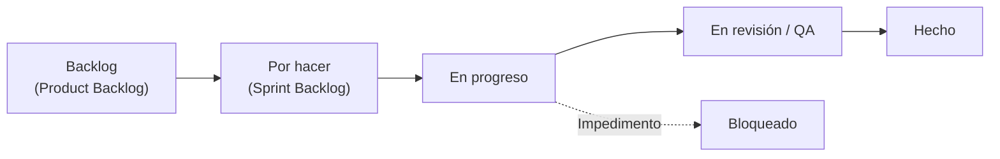
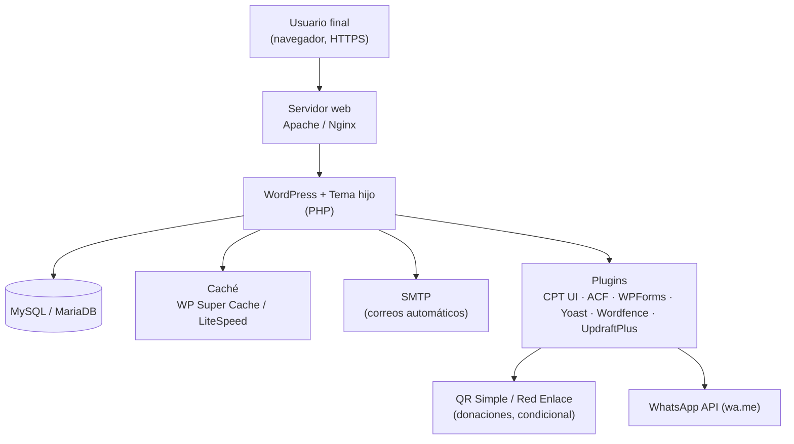
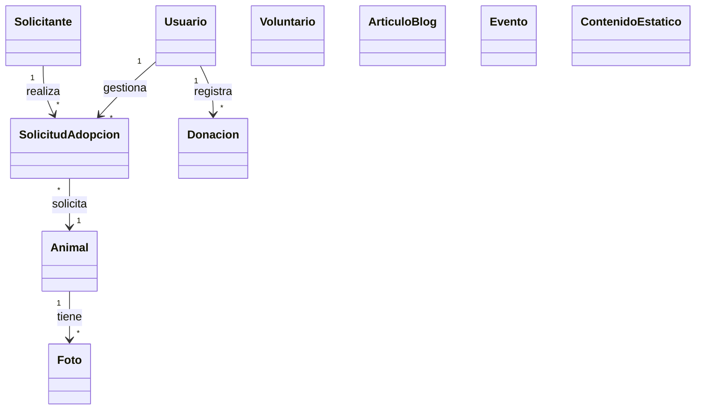
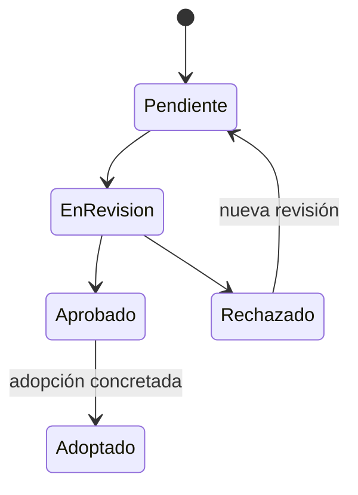

# MANUAL TÉCNICO (MANUAL DE SISTEMAS)

## SITIO WEB Y SISTEMA DE GESTIÓN — ALBERGUE "PELUCHÍN"

---

**PROYECTO:** Desarrollo de sitio web y sistema de gestión para el albergue de perritos "Peluchín"

**ORGANIZACIÓN:** Albergue "Peluchín" — ONG sin fines de lucro (Llojeta, La Paz, Bolivia)

**EQUIPO DESARROLLADOR:** Mariana del Arroyo · Nahomi Humerez · Santiago Acha · Jorge Saenz

**VERSIÓN:** 2.0

**FECHA:** [dd/mm/aaaa]

**ESTADO:** [Borrador / En revisión / Aprobado]

---

## ÍNDICE

1. [Introducción](#1-introducción)
   - 1.1. [Objeto del manual](#11-objeto-del-manual)
   - 1.2. [Alcance](#12-alcance)
   - 1.3. [Público destinatario](#13-público-destinatario)
   - 1.4. [Documentos de referencia](#14-documentos-de-referencia)
2. [Descripción general del sistema](#2-descripción-general-del-sistema)
   - 2.1. [Propósito del sistema](#21-propósito-del-sistema)
   - 2.2. [Usuarios y roles](#22-usuarios-y-roles)
   - 2.3. [Módulos funcionales](#23-módulos-funcionales)
   - 2.4. [Requerimientos no funcionales (resumen)](#24-requerimientos-no-funcionales-resumen)
3. [Metodología de desarrollo — Scrum + Kanban](#3-metodología-de-desarrollo--scrum--kanban)
   - 3.1. [Enfoque híbrido (ScrumBan)](#31-enfoque-híbrido-scrumban)
   - 3.2. [Roles y responsabilidades](#32-roles-y-responsabilidades)
   - 3.3. [Ciclo de sprint (Scrum)](#33-ciclo-de-sprint-scrum)
   - 3.4. [Ceremonias](#34-ceremonias)
   - 3.5. [Artefactos](#35-artefactos)
   - 3.6. [Tablero Kanban y flujo de trabajo](#36-tablero-kanban-y-flujo-de-trabajo)
   - 3.7. [Límites de trabajo en curso (WIP)](#37-límites-de-trabajo-en-curso-wip)
   - 3.8. [Definición de hecho (Definition of Done — DoD)](#38-definición-de-hecho-definition-of-done--dod)
   - 3.9. [Mapeo con el cronograma del proyecto](#39-mapeo-con-el-cronograma-del-proyecto)
   - 3.10. [Herramientas de gestión](#310-herramientas-de-gestión)
4. [Arquitectura del sistema](#4-arquitectura-del-sistema)
   - 4.1. [Vista general (diagrama de arquitectura)](#41-vista-general-diagrama-de-arquitectura)
   - 4.2. [Componentes y servicios externos](#42-componentes-y-servicios-externos)
   - 4.3. [Mapa de navegación — sitio público](#43-mapa-de-navegación--sitio-público)
   - 4.4. [Mapa de navegación — panel de administración](#44-mapa-de-navegación--panel-de-administración)
5. [Stack tecnológico](#5-stack-tecnológico)
   - 5.1. [Plataforma y lenguajes](#51-plataforma-y-lenguajes)
   - 5.2. [Tema y constructor visual](#52-tema-y-constructor-visual)
   - 5.3. [Plugins instalados](#53-plugins-instalados)
   - 5.4. [Herramientas de desarrollo, despliegue y calidad](#54-herramientas-de-desarrollo-despliegue-y-calidad)
6. [Modelo de datos](#6-modelo-de-datos)
   - 6.1. [Entidades principales](#61-entidades-principales)
   - 6.2. [Diagrama de clases UML](#62-diagrama-de-clases-uml)
   - 6.3. [Tipos de contenido personalizados (CPT) y campos ACF](#63-tipos-de-contenido-personalizados-cpt-y-campos-acf)
   - 6.4. [Estados de las entidades](#64-estados-de-las-entidades)
7. [Descripción detallada de módulos y flujos](#7-descripción-detallada-de-módulos-y-flujos)
   - 7.1. [Sitio público](#71-sitio-público)
     - 7.1.1. [Landing y navegación](#711-landing-y-navegación)
     - 7.1.2. [Catálogo y ficha de animales](#712-catálogo-y-ficha-de-animales)
     - 7.1.3. [Formulario de pre-adopción](#713-formulario-de-pre-adopción)
     - 7.1.4. [Donaciones y reporte de donación](#714-donaciones-y-reporte-de-donación)
     - 7.1.5. [Registro de voluntarios](#715-registro-de-voluntarios)
     - 7.1.6. [Blog, eventos, contacto, FAQ](#716-blog-eventos-contacto-faq)
   - 7.2. [Panel de administración](#72-panel-de-administración)
     - 7.2.1. [Dashboard de KPIs](#721-dashboard-de-kpis)
     - 7.2.2. [CRUD de animales](#722-crud-de-animales)
     - 7.2.3. [Gestión de solicitudes de adopción](#723-gestión-de-solicitudes-de-adopción)
     - 7.2.4. [Registro de donaciones](#724-registro-de-donaciones)
     - 7.2.5. [Gestión de voluntarios](#725-gestión-de-voluntarios)
     - 7.2.6. [Blog, eventos y contenido estático](#726-blog-eventos-y-contenido-estático)
     - 7.2.7. [Reportes exportables](#727-reportes-exportables)
   - 7.3. [Notificaciones automáticas por correo](#73-notificaciones-automáticas-por-correo)
8. [Seguridad](#8-seguridad)
   - 8.1. [Autenticación y roles](#81-autenticación-y-roles)
   - 8.2. [SSL/TLS](#82-ssltls)
   - 8.3. [Protección OWASP Top 10](#83-protección-owasp-top-10)
   - 8.4. [Backups y recuperación](#84-backups-y-recuperación)
9. [Despliegue](#9-despliegue)
   - 9.1. [Entornos (local, staging, producción)](#91-entornos-local-staging-producción)
   - 9.2. [Requisitos de servidor](#92-requisitos-de-servidor)
   - 9.3. [Procedimiento de despliegue y migración](#93-procedimiento-de-despliegue-y-migración)
   - 9.4. [Configuración de DNS y SSL](#94-configuración-de-dns-y-ssl)
10. [Pruebas y control de calidad](#10-pruebas-y-control-de-calidad)
    - 10.1. [Pruebas funcionales](#101-pruebas-funcionales)
    - 10.2. [Pruebas de rendimiento](#102-pruebas-de-rendimiento)
    - 10.3. [Pruebas de seguridad](#103-pruebas-de-seguridad)
    - 10.4. [Pruebas de responsividad](#104-pruebas-de-responsividad)
11. [Mantenimiento y soporte](#11-mantenimiento-y-soporte)
    - 11.1. [Actualizaciones](#111-actualizaciones)
    - 11.2. [Procedimientos de operación](#112-procedimientos-de-operación)
    - 11.3. [Monitoreo](#113-monitoreo)
    - 11.4. [Solución de problemas comunes (FAQ técnica)](#114-solución-de-problemas-comunes-faq-técnica)
12. [Riesgos técnicos y contingencias](#12-riesgos-técnicos-y-contingencias)
13. [Glosario](#13-glosario)
14. [Anexos](#14-anexos)

---

## 1. INTRODUCCIÓN

### 1.1. Objeto del manual

El presente manual tiene como objeto documentar la arquitectura, los componentes, los flujos de trabajo, las medidas de seguridad y los procedimientos de operación, despliegue y mantenimiento del sitio web y sistema de gestión del albergue "Peluchín". Está orientado al personal técnico de soporte y mantenimiento, de modo que disponga de una referencia única y verificable para operar, diagnosticar y restaurar el sistema ante cualquier eventualidad.

### 1.2. Alcance

El manual cubre el sitio público y el panel de administración construidos sobre WordPress, incluyendo el modelo de datos, la configuración de plugins, el despliegue en los entornos local/staging/producción, los backups, la seguridad y el mantenimiento. No cubre el uso cotidiano del panel (ver Manual de Usuario / Manual de Administrador) ni las condiciones comerciales del contrato (ver `docs/TDR_Contrato_Peluchin.md`).

### 1.3. Público destinatario

- Desarrolladores y personal técnico de soporte.
- Administradores del hosting.
- Personal técnico del albergue designado para mantenimiento.

### 1.4. Documentos de referencia

| # | Documento | Contenido de referencia |
|---|-----------|--------------------------|
| 1 | `docs/TDR_Peluchin.md` | Alcance, requerimientos funcionales y no funcionales, stack, entregables |
| 2 | `docs/TDR_Plan_Proyecto_Cronograma_Peluchin.md` | Plan de sprints, metodología, stack de plugins, herramientas, despliegue |
| 3 | `docs/TDR_Contrato_Peluchin.md` | Alcance contractual, garantía, propiedad intelectual |
| 4 | `docs/TDR_Carta_Aceptacion_Peluchin.md` | Aceptación del proyecto |
| 5 | `docs/TDR_Gestion_Riesgos_Peluchin.md` | Riesgos técnicos y planes de mitigación/contingencia |
| 6 | `docs/TDR_Diagrama_WAE_Peluchin.md` | Mapas de navegación y arquitectura web |
| 7 | `docs/bitacoras/` | Bitácoras de los Sprint 1–4 y retrospectivas |
| 8 | `docs/Acta_Final_Entrega_Peluchin.md` | Acta de entrega y recepción del proyecto |
| 9 | `docs/mockup/` | Mockups HTML del sitio público |

> Nota: El diagrama UML del modelo de datos se incorporará como anexo cuando el documento `TDR_Diagrama_UML_Peluchin.md` esté disponible; mientras tanto, las secciones §6 de este manual recogen el modelo de datos vigente.

---

## 2. DESCRIPCIÓN GENERAL DEL SISTEMA

### 2.1. Propósito del sistema

El sistema tiene como propósito visibilizar a los perritos en adopción del albergue "Peluchín", gestionar de forma transparente las donaciones (mediante QR Simple, transferencia y efectivo), registrar voluntarios con sus áreas de interés y disponibilidad, difundir información (blog, eventos, FAQ) y administrar de forma centralizada los animales, las solicitudes de adopción, las donaciones y los voluntarios desde un panel de administración. Fuente: TDR §3, TDR_Why_Peluchin.md.

### 2.2. Usuarios y roles

| Rol | Descripción | Acceso | Permisos principales |
|-----|-------------|--------|----------------------|
| Visitante / Adoptante / Donante / Voluntario | Público general | Sitio público (sin autenticación) | Enviar formularios (pre-adopción, reporte de donación, voluntariado, contacto) |
| Administrador | Personal del albergue con control total | Panel `/admin` | Todo: usuarios, configuración, CRUD de animales, solicitudes, donaciones, voluntarios, blog, eventos, contenido |
| Editor | Contenido editorial (blog, páginas, eventos) | Panel `/admin` (permisos limitados) | CRUD de blog, eventos y contenido estático; sin gestión de donaciones, voluntarios ni configuración |
| Voluntario | Colaborador con acceso limitado | Panel `/admin` (solo lectura en su área) | Consulta de su información y de los animales; sin modificación de datos |
| Sistema | WordPress + plugins (correos, seguridad, backups) | Interno | Notificaciones automáticas, backups, monitoreo |

> Configurado con Members / User Role Editor (Plan §Sprint 3). Fuente: TDR §5.1, Plan §Sprint 3.

### 2.3. Módulos funcionales

| Módulo | Descripción | Fuente |
|--------|-------------|--------|
| Sitio web público | Landing, Quiénes somos, catálogo, pre-adopción, donaciones, voluntarios, eventos, blog, contacto, FAQ | TDR §4.1, WAE §2 |
| Catálogo de perritos | Fichas con galería, datos y estado | TDR §4.1, UML §3 |
| Formulario de pre-adopción | Multi-paso con notificaciones | UML §4, §6 |
| Sistema de donaciones | QR Simple, datos bancarios, reporte | UML §5 |
| Registro de voluntarios | Áreas de interés y disponibilidad | TDR §4.1 |
| Panel de administración | Dashboard, CRUD animales, solicitudes, donaciones, voluntarios, blog, eventos, contenido | TDR §5.1, WAE §3 |

### 2.4. Requerimientos no funcionales (resumen)

| # | Requerimiento | Meta |
|---|---------------|------|
| RNF01 | Rendimiento | Carga < 3 s en 4G |
| RNF02 | Disponibilidad | 99% uptime |
| RNF03 | Seguridad | HTTPS, OWASP Top 10, backups automáticos |
| RNF04 | Responsividad | Mobile-first |
| RNF05 | Usabilidad | Interfaz intuitiva |
| RNF06 | Mantenibilidad | Código documentado, modular |
| RNF07 | Idioma | Español |
| RNF08 | Accesibilidad | Contraste, alt en imágenes |

> Fuente: `docs/TDR_Peluchin.md` §6.

---

## 3. METODOLOGÍA DE DESARROLLO — SCRUM + KANBAN

### 3.1. Enfoque híbrido (ScrumBan)

El proyecto se desarrolla con una metodología híbrida **ScrumBan**, que combina el marco **Scrum** (sprints de 2 semanas, ceremonias y artefactos) con el método **Kanban** (visualización del flujo de trabajo en un tablero y límites de trabajo en curso). Esta combinación se adoptó por las siguientes razones:

- **Entregas incrementales y demostrables:** cada 2 semanas se presenta al albergue un incremento funcional (demo) que puede aprobar o solicitar ajustes.
- **Transparencia del estado:** el tablero Kanban permite ver en tiempo real en qué columna está cada tarea (Backlog → Hecho).
- **Flexibilidad:** las prioridades pueden ajustarse en la revisión del backlog sin comprometer el objetivo del sprint vigente.
- **Eficiencia en equipos pequeños:** al limitar el trabajo en curso (WIP) se evita la multitarea y se acelera el flujo de entregables.

El marco es **Scrum** para la *planificación* (sprints de 2 semanas) y **Kanban** para la *ejecución* (flujo continuo de tareas por el tablero). Fuente: Plan §Metodología, README §Resumen del proyecto.

### 3.2. Roles y responsabilidades

| Rol | Integrante | Responsabilidades |
|-----|------------|-------------------|
| **Product Owner** | Responsable del albergue "Peluchín" | Priorizar el Product Backlog, definir criterios de aceptación, aprobar las demos (máx. 5 días hábiles), proveer las dependencias (logo, fotos, contenido, hosting) |
| **Scrum Master** | Mariana del Arroyo | Facilitar las ceremonias, eliminar impedimentos, resguardar la metodología y coordinar con el hosting y el albergue |
| **Equipo de desarrollo** | Nahomi Humerez (diseño/UX y landing), Santiago Acha (configuración/backend y formularios), Jorge Saenz (QA/testing, manuales y capacitación) | Auto-organizarse para diseñar, construir, probar y documentar el incremento de cada sprint |
| **Interesados** | Personal del albergue | Participar en las demos, pruebas de aceptación y aportar contenido |

> Fuente: TDR_Plan §Reuniones programadas y bitácoras de los Sprint 1–4.

### 3.3. Ciclo de sprint (Scrum)

Cada sprint tiene una duración fija de **2 semanas (14 días)** y se desarrolla dentro de las 8 semanas de desarrollo. El flujo del ciclo es:

1. **Planificación (día 1):** el equipo selecciona las historias del Product Backlog priorizadas por el Product Owner, define el objetivo del sprint y confirma el Sprint Backlog.
2. **Ejecución (días 1–13):** las tareas avanzan por las columnas del tablero Kanban respetando los límites de WIP; se realiza el Daily Stand-up y se registran los avances en la bitácora del sprint.
3. **Revisión / Demo (día 14):** se presenta el incremento funcional al albergue (entregables E1–E10); el Product Owner aprueba o solicita ajustes.
4. **Retrospectiva (día 14):** el equipo analiza qué salió bien, qué puede mejorar y acuerda acciones para el siguiente sprint.

### 3.4. Ceremonias

| Ceremonia | Frecuencia | Participantes | Propósito |
|-----------|------------|---------------|-----------|
| **Sprint Planning** | Inicio de cada sprint (día 1) | Product Owner + Equipo + Scrum Master | Definir el objetivo del sprint y el Sprint Backlog |
| **Daily Stand-up** | Diaria (15 min) | Equipo + Scrum Master | Sincronizar avances, plan del día e impedimentos |
| **Sprint Review (Demo)** | Fin de sprint (día 14) | Product Owner + Equipo + Interesados | Presentar el incremento funcional y recoger feedback |
| **Sprint Retrospective** | Fin de sprint (tras la demo) | Equipo + Scrum Master | Mejora continua del proceso |
| **Backlog Refinement** | Semanal (30–60 min) | Product Owner + Equipo | Priorizar y detallar las historias del backlog |
| **Comunicación rápida** | Continua (horario laboral) | Equipo + Albergue | Consultas y avances por WhatsApp |

> Fuente: TDR_Plan §Reuniones programadas.

### 3.5. Artefactos

| Artefacto | Descripción |
|-----------|-------------|
| **Product Backlog** | Lista priorizada de funcionalidades e historias derivadas de los requerimientos del TDR |
| **Sprint Backlog** | Tareas comprometidas para el sprint en curso, extraídas del backlog |
| **Incremento** | Resultado funcional y demostrable de cada sprint (E1–E10) |
| **Definition of Done (DoD)** | Criterios que una tarea debe cumplir para considerarse terminada (ver §3.8) |
| **Gráfico burndown** | Evolución del trabajo pendiente durante el sprint |
| **Bitácora del sprint** | Registro de actividades, incidencias, resultados de la demo y retrospectiva |

### 3.6. Tablero Kanban y flujo de trabajo

El tablero organiza el trabajo en las siguientes columnas:

| Columna | Política de entrada | Política de salida |
|---------|---------------------|--------------------|
| **Backlog** | Historias priorizadas por el Product Owner | Seleccionadas en el Sprint Planning |
| **Por hacer** | Tareas comprometidas en el Sprint Backlog | La tarea tiene dueño y está lista para iniciarse |
| **En progreso** | Se respeta el límite de WIP | Funcionalidad implementada y configurada |
| **En revisión / QA** | La funcionalidad pasa a pruebas | Pruebas superadas sin errores críticos |
| **Hecho** | Cumple la DoD (§3.8) | Verificada y, si corresponde, aprobada en la demo |
| **Bloqueado** | Existe un impedimento externo (dependencia del albergue) | Se gestiona el desbloqueo con el Scrum Master |

### 3.7. Límites de trabajo en curso (WIP)

- Con un equipo pequeño, se establece un **WIP máximo por columna** (p. ej. **2** en "En progreso" y **1** en "En revisión/QA") para evitar la multitarea y reducir el tiempo de ciclo.
- **Política de flujo:** una tarjeta solo se mueve a la siguiente columna si cumple la política de salida de la columna anterior.
- **Trabajo bloqueado:** las tarjetas con impedimentos se mueven a la columna "Bloqueado" y se gestionan en el Daily Stand-up.

### 3.8. Definición de hecho (Definition of Done — DoD)

Una tarea se considera **terminada** cuando cumple todos los criterios siguientes:

1. Cumple los **criterios de aceptación** definidos en la historia o requerimiento.
2. La configuración o código está **versionada en Git** (GitHub/GitLab).
3. Está **probada** en el entorno correspondiente (local → staging → producción).
4. Los **formularios y notificaciones por correo** asociados fueron verificados.
5. No presenta **errores críticos**, o los bugs conocidos están documentados y aceptados por el Product Owner.
6. La **documentación y la bitácora del sprint** están actualizadas.
7. Cuando corresponde a un entregable (E1–E10), fue **aprobada en la demo**.

### 3.9. Mapeo con el cronograma del proyecto

| Sprint | Semanas | Objetivo | Entregables | Resultado de la demo |
|--------|---------|----------|-------------|----------------------|
| **Sprint 1** | 1–2 | Instalación, tema y estructura | E1, E2, E3 | Sitio base + galería de animales |
| **Sprint 2** | 3–4 | Formularios, donaciones y contenido | E4 | Sitio público completo |
| **Sprint 3** | 5–6 | Panel de administración y funcionalidades avanzadas | E5, E6 | Panel completo + blog + eventos |
| **Sprint 4** | 7–8 | QA, despliegue, documentación y capacitación | E7, E8, E9, E10 | Sitio en producción + documentación |
| **Garantía** | 9–16 | Monitoreo, soporte y actualizaciones | E11 | Fin del contrato |

> Fuente: TDR_Plan §SPRINT 1–4 y §PERÍODO DE GARANTÍA.

### 3.10. Herramientas de gestión

| Herramienta | Uso metodológico |
|-------------|------------------|
| Trello / Jira / Notion | Tablero Kanban, backlog y seguimiento de tareas |
| Git + GitHub / GitLab | Control de versiones del tema y configuración |
| Figma | Wireframes, mockups y prototipos |
| Google Meet / Zoom | Reuniones, demos y capacitación |
| WhatsApp | Comunicación rápida (horario laboral) |
| Bitácoras (`docs/bitacoras/`) | Registro de cada sprint, demo y retrospectiva |

---

## 4. ARQUITECTURA DEL SISTEMA

### 4.1. Vista general (diagrama de arquitectura)

> Fuente: UML §8 (stack WordPress) y diagrama WAE §4. Renderizable en GitHub / mermaid.live.

### 4.2. Componentes y servicios externos

| Componente | Rol | Estado |
|------------|-----|--------|
| Servidor web (Apache / Nginx) | Sirve el sitio | Producción |
| WordPress + tema hijo | Motor PHP / presentación | Producción |
| Plugins (CPT UI, ACF, WPForms, Yoast, Wordfence, UpdraftPlus, WP Mail SMTP, Really Simple SSL) | Funcionalidad | Producción |
| MySQL / MariaDB | Persistencia | Producción |
| SMTP (Gmail / Resend / SendGrid) | Correos automáticos | Producción |
| QR Simple + datos bancarios | Canal de donación | Producción |
| WhatsApp API (`wa.me`) | Contacto / compartir | Producción |
| Red Enlace | Pasarela de pago | Condicional (solo con habilitación de la ONG) |

### 4.3. Mapa de navegación — sitio público

| Página | Ruta | Formularios |
|--------|------|-------------|
| Inicio | `/` | — |
| Quiénes somos | `/quienes-somos` | — |
| Catálogo | `/adoptar` | — |
| Ficha del animal | `/ficha` | — |
| Pre-adopción | `/adopcion` | Solicitud en 3 pasos |
| Donaciones | `/donar` | Reporte de donación |
| Voluntarios | `/voluntarios` | Registro de voluntario |
| Blog | `/blog` | — |
| Eventos | `/eventos` | Confirmación de asistencia |
| Contacto | `/contacto` | WhatsApp / formulario |
| FAQ | `/faq` | — |

> Fuente: `docs/TDR_Diagrama_WAE_Peluchin.md` §2.

### 4.4. Mapa de navegación — panel de administración

| Página | Ruta | Formularios |
|--------|------|-------------|
| Inicio de sesión | `/admin/login` | Credenciales |
| Dashboard KPIs | `/admin` | — |
| Animales | `/admin/animales` | CRUD + estado |
| Solicitudes | `/admin/solicitudes` | Estado + notas internas |
| Donaciones | `/admin/donaciones` | Registro manual |
| Voluntarios | `/admin/voluntarios` | Edición / filtros |
| Blog | `/admin/blog` | CRUD |
| Eventos | `/admin/eventos` | CRUD + asistentes |
| Contenido estático | `/admin/contenido` | Edición de secciones |

> Fuente: `docs/TDR_Diagrama_WAE_Peluchin.md` §3.

---

## 5. STACK TECNOLÓGICO

### 5.1. Plataforma y lenguajes

| Componente | Tecnología | Versión instalada |
|------------|------------|-------------------|
| CMS | WordPress | [última estable] |
| Lenguaje | PHP | 8+ |
| Base de datos | MySQL / MariaDB | [versión] |
| Servidor web | Apache / Nginx | [versión] |

### 5.2. Tema y constructor visual

| Herramienta | Uso |
|-------------|-----|
| Tema base: Astra | Tema principal (según bitácora Sprint 1) |
| Tema hijo Peluchín | Personalización y marca del albergue |
| Gutenberg / Elementor | Construcción visual |
| CSS personalizado | Ajustes de diseño |

### 5.3. Plugins instalados

| Plugin | Funcionalidad | Versión | Estado |
|--------|---------------|---------|--------|
| Custom Post Type UI | CPT "Animales", "Eventos" | — | Activo |
| Advanced Custom Fields (ACF) | Campos personalizados | — | Activo |
| WPForms Lite / Contact Form 7 | Pre-adopción, donación, voluntarios | — | Activo |
| GiveWP / Donation Platform | Donaciones | — | Activo |
| WP Mail SMTP | Correos automáticos | — | Activo |
| MailPoet / FluentCRM | Notificaciones | — | Activo |
| Yoast SEO / Rank Math | SEO | — | Activo |
| Really Simple SSL | SSL/TLS | — | Activo |
| UpdraftPlus | Backups | — | Activo |
| Wordfence / Sucuri | Seguridad | — | Activo |
| WP Super Cache / LiteSpeed | Caché | — | Activo |
| Smush / EWWW | Optimización de imágenes | — | Activo |

> [Pendiente] Completar versiones y plugins finales en producción. Fuente: `docs/TDR_Plan_Proyecto_Cronograma_Peluchin.md`.

### 5.4. Herramientas de desarrollo, despliegue y calidad

| Herramienta | Uso |
|-------------|-----|
| Local by Flywheel / XAMPP | Entorno local |
| Git + GitHub / GitLab | Control de versiones |
| All-in-One WP Migration / Migrate Guru | Migración |
| cPanel / Plesk | Administración del hosting |
| PageSpeed / Lighthouse / GTmetrix | Rendimiento |
| Responsively / BrowserStack | Responsividad |
| WPScan | Seguridad WordPress |

---

## 6. MODELO DE DATOS

### 6.1. Entidades principales

| Entidad | Descripción | Claves de referencia |
|---------|-------------|----------------------|
| Usuario | Usuarios del sistema con rol | UML §3 |
| Animal | Perros/gatos en adopción | UML §3 |
| Foto | Galería de cada animal | UML §3 |
| Solicitante | Persona que postula a adopción | UML §3 |
| SolicitudAdopcion | Postulación con estados y seguimiento | UML §3, §7 |
| Donacion | Donaciones registradas (manual o reporte web) | UML §3 |
| Voluntario | Registro de colaboradores | UML §3 |
| ArticuloBlog | Noticias y publicaciones | UML §3 |
| Evento | Eventos y galería | UML §3 |
| ContenidoEstatico | Quiénes somos, misión, FAQ, donaciones | UML §3 |

### 6.2. Diagrama de clases UML

> Fuente: `docs/TDR_Diagrama_UML_Peluchin.md` §3 (renderizable con mermaid).

### 6.3. Tipos de contenido personalizados (CPT) y campos ACF

| CPT | Taxonomías | Campos ACF principales |
|-----|------------|------------------------|
| Animales | especie, tamaño, edad, estado | nombre, sexo, raza, peso_kg, estado_salud, personalidad, historia, fecha_rescate, fotos |
| Solicitudes | — | tipo_vivienda, patio_jardin, experiencia_mascotas, otras_mascotas, referencias, notas_internas, numero_seguimiento |
| Eventos | — | fecha_hora, ubicacion, imagen, fotos_galeria, asistentes |
| Blog | categorías | titulo, imagen_destacada, contenido, estado |

> [Pendiente] Documentar la configuración final de CPT UI + ACF del entorno de producción.

### 6.4. Estados de las entidades

| Entidad | Estados |
|---------|---------|
| Animal | en_adopcion · adoptado · en_tratamiento |
| SolicitudAdopcion | pendiente · en_revision · aprobado · rechazado |
| Donacion | medio: efectivo · transferencia · qr · tarjeta |
| ArticuloBlog | borrador · publicado |
| Evento | próximo · pasado |
| Usuario | roles: admin · editor · voluntario |

Diagrama de estados de la solicitud de adopción (UML §7):

---

## 7. DESCRIPCIÓN DETALLADA DE MÓDULOS Y FLUJOS

### 7.1. Sitio público

#### 7.1.1. Landing y navegación

- Hero con mensaje de bienvenida y llamados a la acción (CTA): **"Quiero Adoptar"**, **"Quiero Donar"**, **"Ser Voluntario"**.
- Contador de perritos rescatados y sección de animales destacados.
- Menú de navegación principal, header con logo del albergue y footer con redes sociales.
- Botón flotante de WhatsApp visible en todo el sitio.

#### 7.1.2. Catálogo y ficha de animales

- Galería con **filtros por taxonomía**: especie, tamaño, edad y estado.
- Ficha individual con galería de fotos (slider) y datos: nombre, sexo, raza, peso, estado de salud, personalidad, historia y fecha de rescate.
- CTA según el estado del animal:
  - `en_adopcion` → botón **"Quiero Adoptar"** (abre el formulario de pre-adopción).
  - `en_tratamiento` → botón **"Avísame"** (notificación al usuario).
  - `adoptado` → botón deshabilitado con indicador **"Adoptado"**.

> Referencia: UML §6 (diagrama de actividad).

#### 7.1.3. Formulario de pre-adopción

Formulario multi-paso con notificaciones automáticas:

- **Paso 1:** datos personales del solicitante (nombre, CI, teléfono, correo).
- **Paso 2:** vivienda y experiencia con mascotas (tipo de vivienda, patio/jardín, otras mascotas, experiencia previa).
- **Paso 3:** referencias, aceptación del reglamento y envío.

Al enviarse: validaciones por paso, generación de **número de seguimiento**, correo de confirmación al solicitante y notificación de "nueva solicitud pendiente" al administrador. Referencia: UML §4 (secuencia), §6 (actividad).

#### 7.1.4. Donaciones y reporte de donación

- Código **QR Simple** y datos bancarios con botón **"Copiar"**.
- Formulario de reporte de donación (monto, fecha, comprobante adjunto).
- Confirmación en pantalla y correo de agradecimiento al donante; notificación al administrador. Referencia: UML §5 (secuencia).

#### 7.1.5. Registro de voluntarios

Formulario con datos personales, **áreas de interés** (paseo, limpieza, veterinaria, difusión, eventos, transporte, captación) y **disponibilidad horaria**. Al enviarse: correo de confirmación al voluntario y notificación de "nuevo voluntario" al administrador.

#### 7.1.6. Blog, eventos, contacto, FAQ

- **Blog:** publicaciones con categorías y editor nativo.
- **Eventos:** registro/confirmación de asistencia con fecha, ubicación y galería.
- **Contacto:** botón de WhatsApp (`wa.me`) y mapa de Google Maps.
- **FAQ:** secciones plegables (acordeón) con preguntas frecuentes.

### 7.2. Panel de administración

#### 7.2.1. Dashboard de KPIs

Widgets con indicadores del albergue: **perritos en adopción**, **solicitudes pendientes**, **donaciones del mes (Bs.)** y **voluntarios activos**.

#### 7.2.2. CRUD de animales

Creación, edición y eliminación de fichas de animales; carga de **múltiples fotos**; cambio de estado (`en_adopcion` → `adoptado` / `en_tratamiento`).

#### 7.2.3. Gestión de solicitudes de adopción

- Flujo de estados: `pendiente` → `en_revision` → `aprobado` / `rechazado` (ver §6.4).
- **Notas internas** por solicitud y número de seguimiento.
- **Correos automáticos** al aprobar o rechazar (instrucciones de adopción / mensaje amable).

#### 7.2.4. Registro de donaciones

Registro manual (efectivo, transferencia, QR) con monto, fecha y donante; **exportación** a Excel.

#### 7.2.5. Gestión de voluntarios

Listado con **filtros por área de interés**, edición de datos y exportación.

#### 7.2.6. Blog, eventos y contenido estático

- CRUD de noticias del blog.
- Gestión de eventos (fecha, ubicación, galería, asistentes).
- Edición de secciones estáticas (Quiénes Somos, misión, FAQ, donaciones) mediante **ACF Options Pages**.

#### 7.2.7. Reportes exportables

Exportación a Excel de perritos, adopciones y donaciones por mes.

### 7.3. Notificaciones automáticas por correo

| Flujo | Correo al solicitante/donante/voluntario | Notificación al admin |
|-------|------------------------------------------|-----------------------|
| Pre-adopción | Confirmación + número de seguimiento | Nueva solicitud pendiente |
| Donación | Agradecimiento | Nueva donación reportada |
| Voluntario | Confirmación de registro | Nuevo voluntario |
| Aprobación de adopción | Instrucciones de adopción | — |
| Rechazo | Mensaje amable | — |

> [Pendiente] Detallar plantillas, remitente (SMTP) y configuración de WP Mail SMTP. Referencia: TDR §4.1 (Notificaciones), UML §4–§5.

---

## 8. SEGURIDAD

### 8.1. Autenticación y roles

- Inicio de sesión en `/admin/login` con roles definidos en §2.2 (Members / User Role Editor).
- **Límite de intentos** de inicio de sesión (Wordfence) y **autenticación de doble factor (2FA)** recomendada.
- Principio de **menor privilegio**: cada rol solo accede a lo necesario. Referencia: TDR §5.1, Riesgos T02/T11.

### 8.2. SSL/TLS

- Certificado SSL activo (**Let's Encrypt**) en producción (según bitácora Sprint 4).
- Redirección **HTTP → HTTPS** y renovación automática gestionadas con Really Simple SSL. Referencia: RNF03, E8.

### 8.3. Protección OWASP Top 10

| Área | Medida | Plugin / Configuración |
|------|--------|------------------------|
| Inyección SQL | Sanitización de inputs, consultas preparadas | WordPress core + ACF |
| XSS | Sanitización de salida | WordPress core |
| CSRF | Nonces de WordPress | WordPress core |
| Brute force | Límite de intentos de login | Wordfence |
| Datos sensibles | Encriptación, HTTPS | Really Simple SSL |

> [Pendiente] Completar con el hardening aplicado (prefijo de BD, etc.). Referencia: TDR §4.1 (Seguridad), RNF03.

### 8.4. Backups y recuperación

| Aspecto | Configuración |
|---------|---------------|
| Frecuencia | Diario |
| Herramienta | UpdraftPlus |
| Destino remoto | [Google Drive / Dropbox] |
| Retención | [n] copias |
| Verificación | [frecuencia] restauración de prueba |
| Backup previo a migraciones | Manual obligatorio |

> Referencia: Riesgo T10, Plan §Sprint 3.

---

## 9. DESPLIEGUE

### 9.1. Entornos (local, staging, producción)

| Entorno | URL | Uso |
|---------|-----|-----|
| Local | [localhost] | Desarrollo (Local by Flywheel / XAMPP) |
| Staging | [URL staging] | Pruebas y QA |
| Producción | [URL dominio] | Sitio público |

### 9.2. Requisitos de servidor

| Requisito | Valor |
|-----------|-------|
| PHP | 8+ |
| MySQL / MariaDB | [versión] |
| Espacio en disco | [n] GB |
| PHP.ini (límites de subida) | [n] MB |
| Extras | [cPanel/Plesk, acceso SSH/FTP] |

> Referencia: Riesgos T04, T05.

### 9.3. Procedimiento de despliegue y migración

1. Backup completo en el entorno de origen.
2. Migración con All-in-One WP Migration / Migrate Guru.
3. Corrección de rutas y URLs (search-replace si aplica).
4. Verificación de enlaces, medios y formularios.
5. Pruebas post-despliegue (smoke test).

> Referencia: Plan §Sprint 4, Riesgos T04. Guía replicable según la retrospectiva del Sprint 4.

### 9.4. Configuración de DNS y SSL

1. Registrar el dominio y apuntar los registros **DNS (A/CNAME)** al hosting.
2. Instalar el certificado SSL (Let's Encrypt) y activar la redirección HTTPS.
3. Verificar el candado de seguridad en el navegador y la renovación automática.

---

## 10. PRUEBAS Y CONTROL DE CALIDAD

### 10.1. Pruebas funcionales

| Caso de prueba | Resultado esperado | Estado |
|----------------|--------------------|--------|
| Pre-adopción completa | Solicitud guardada + correos + número de seguimiento | [Pendiente] |
| Reporte de donación | Donación registrada + correo de agradecimiento | [Pendiente] |
| Registro de voluntario | Voluntario visible en admin | [Pendiente] |
| CRUD de animales | Crear/editar/eliminar/cambiar estado | [Pendiente] |
| Cambio de estado de solicitud | Flujo completo con notificaciones | [Pendiente] |
| Filtros de galería por taxonomía | Resultados correctos por especie/tamaño/edad/estado | [Pendiente] |
| Botón flotante de WhatsApp | Enlace `wa.me` correcto en móvil y escritorio | [Pendiente] |

> [Pendiente] Ampliar la matriz de pruebas. Referencia: E7, UML §4–§6.

### 10.2. Pruebas de rendimiento

- Herramientas: PageSpeed, Lighthouse, GTmetrix.
- Meta: carga < 3 s en 4G (**RNF01**) y puntaje Lighthouse ≥ 90 en móvil (según bitácora Sprint 4).
- Acciones: optimización de imágenes (Smush/EWWW) y activación de caché (WP Super Cache). Referencia: Riesgo T03.

### 10.3. Pruebas de seguridad

- Escaneos con **WPScan** y **Wordfence**; revisión de hardening y de backups restaurables. Referencia: Riesgos T02, T11.

### 10.4. Pruebas de responsividad

- Dispositivos móviles y navegadores (Chrome, Firefox, Safari, Edge) con Responsively / BrowserStack. Referencia: RNF04.

---

## 11. MANTENIMIENTO Y SOPORTE

### 11.1. Actualizaciones

| Componente | Frecuencia | Procedimiento |
|------------|------------|---------------|
| WordPress core | Mensual | Prueba en staging → backup → actualizar |
| Plugins | Mensual | Prueba en staging → backup → actualizar |
| Tema hijo | Según cambios | Control de versiones en Git |

> Referencia: Plan §Garantía, Riesgos T01, T06.

### 11.2. Procedimientos de operación

- **Modo mantenimiento:** activar desde plugin o `.maintenance` para intervenciones.
- **Restauración de backup:** descargar el backup de UpdraftPlus y restaurar en el entorno afectado.
- **Cambio de credenciales:** rotar contraseñas del panel, hosting y SMTP ante cualquier sospecha.
- **Gestión de cuentas:** alta/baja de usuarios del panel según roles (§2.2).

### 11.3. Monitoreo

- **Uptime:** monitoreo de disponibilidad (UptimeRobot o similar) — meta 99% (RNF02).
- **Correos:** verificación de entregabilidad del SMTP (Riesgo T07).
- **Seguridad:** revisión de alertas de Wordfence y escaneos periódicos. Referencia: Riesgo T08.

### 11.4. Solución de problemas comunes (FAQ técnica)

| Problema | Causa probable | Solución |
|----------|----------------|----------|
| Correos no llegan | SMTP mal configurado | Revisar WP Mail SMTP (Riesgo T07) |
| Sitio lento | Caché/plugins/imágenes | Purgar caché, optimizar (Riesgo T03) |
| Pantalla en blanco | Plugin/tema conflictivo | Desactivar vía FTP/phpMyAdmin (Riesgo T01) |
| Enlaces rotos tras migración | URLs antiguas | Search-replace en BD (Riesgo T04) |
| Error de conexión a BD | Credenciales/caída de hosting | Verificar `wp-config.php` y hosting (Riesgo T08) |

---

## 12. RIESGOS TÉCNICOS Y CONTINGENCIAS

| ID | Riesgo | Mitigación | Contingencia |
|----|--------|------------|--------------|
| T01 | Incompatibilidad de plugins | Staging, plugins con soporte | Desactivar/reeemplazar plugin |
| T02 | Vulnerabilidades de seguridad | Wordfence, updates, backups | Restaurar backup limpio |
| T03 | Rendimiento | Mínimo de plugins, caché, CDN | Desactivar plugins no esenciales |
| T04 | Fallos de migración | Prueba previa, backup | Re-migrar, search-replace |
| T05 | PHP incompatible | Verificar requisitos | Actualizar PHP en hosting |
| T06 | Conflictos de tema | Tema hijo + staging | Revertir actualización |
| T07 | Fallos de correos | SMTP real, pruebas | Cambiar proveedor SMTP |
| T08 | Caída del hosting | Monitoreo, caché | Escalar plan / VPS |
| T10 | Pérdida de datos | Backups diarios | Restaurar último backup |
| T11 | Hackeo | Hardening, 2FA, monitoreo | Restaurar + limpiar + rotar credenciales |

> **[Insertar]** Mapa completo de riesgos. Fuente: `docs/TDR_Gestion_Riesgos_Peluchin.md`.

---

## 13. GLOSARIO

| Término | Definición |
|---------|------------|
| CMS | Sistema de gestión de contenidos |
| CPT | Custom Post Type (tipo de contenido personalizado) |
| ACF | Advanced Custom Fields (campos personalizados) |
| CPT UI | Plugin para crear tipos de contenido personalizados |
| Staging | Entorno de pruebas previo a producción |
| SSL/TLS | Protocolo de cifrado de comunicaciones |
| SMTP | Protocolo de envío de correos |
| QR Simple | Método de donación por código QR |
| Red Enlace | Pasarela de pago boliviana (condicional) |
| OWASP Top 10 | Lista de riesgos de seguridad web más comunes |
| Uptime | Disponibilidad del servicio |
| Scrum | Marco ágil de gestión basado en sprints, ceremonias y artefactos |
| Kanban | Método de gestión visual del flujo de trabajo mediante un tablero |
| ScrumBan | Metodología híbrida que combina Scrum y Kanban |
| Sprint | Iteración de trabajo con duración fija (2 semanas en este proyecto) |
| Product Backlog | Lista priorizada de funcionalidades del producto |
| Sprint Backlog | Tareas comprometidas para el sprint en curso |
| WIP | Work In Progress: límite de trabajo en curso por columna |
| Daily Stand-up | Reunión diaria breve de sincronización del equipo |
| Sprint Review (Demo) | Reunión de fin de sprint para presentar el incremento |
| Retrospectiva | Reunión de mejora continua del proceso |
| Definition of Done (DoD) | Criterios que una tarea debe cumplir para considerarse terminada |
| Burndown | Gráfico del avance del trabajo durante el sprint |
| Product Owner | Responsable de priorizar el backlog y aceptar entregas |

---

## 14. ANEXOS

- **Anexo A:** Diagrama de arquitectura y despliegue (UML §8, WAE §4).
- **Anexo B:** Mapas de navegación (WAE §2, §3).
- **Anexo C:** Diagrama de clases y modelo de datos (UML §3).
- **Anexo D:** Diagramas de secuencia y estados (UML §4–§7).
- **Anexo E:** Tablero Kanban y plantillas de ceremonias Scrum.
- **Anexo F:** Registro de riesgos técnicos completo (Gestión de Riesgos §4.1).
- **Anexo G:** Checklist de pruebas post-despliegue.

---

### CIERRE

Este manual es un documento vivo: se actualizará ante cambios de alcance aprobados por adenda, según lo establecido en el contrato (`docs/TDR_Contrato_Peluchin.md`) y en el cierre del documento UML. Cualquier modificación de la configuración, del modelo de datos o de los procedimientos de operación debe quedar registrada en la bitácora del sprint correspondiente.
