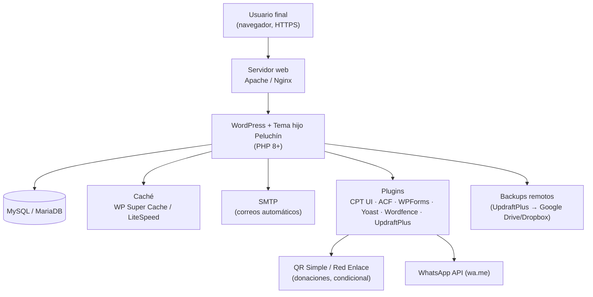
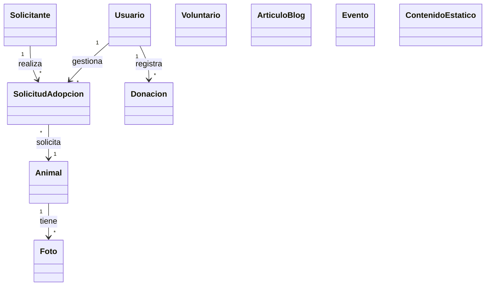
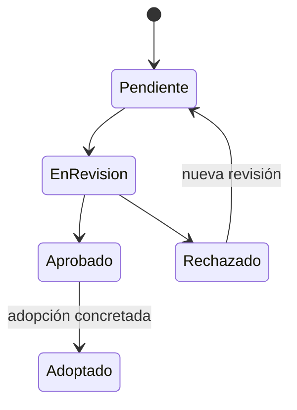

# MANUAL TÉCNICO (MANUAL DE SISTEMAS)

## SITIO WEB Y SISTEMA DE GESTIÓN — ALBERGUE "PELUCHÍN"

---

**PROYECTO:** Desarrollo de sitio web y sistema de gestión para el albergue de perritos "Peluchín"

**ORGANIZACIÓN:** Albergue "Peluchín" — ONG sin fines de lucro (Llojeta, La Paz, Bolivia)

**EQUIPO DESARROLLADOR:** Mariana del Arroyo · Nahomi Humerez · Santiago Acha · Jorge Saenz

**VERSIÓN:** 1.0

**FECHA:** 14/08/2026

**ESTADO:** Aprobado — Sistema en producción

---

## ÍNDICE

1. [Introducción](#1-introducción)
   - 1.1. [Objeto del manual](#11-objeto-del-manual)
   - 1.2. [Alcance](#12-alcance)
   - 1.3. [Público destinatario](#13-público-destinatario)
   - 1.4. [Documentos de referencia](#14-documentos-de-referencia)
   - 1.5. [Datos de producción](#15-datos-de-producción)
2. [Descripción general del sistema](#2-descripción-general-del-sistema)
   - 2.1. [Propósito del sistema](#21-propósito-del-sistema)
   - 2.2. [Usuarios y roles](#22-usuarios-y-roles)
   - 2.3. [Módulos funcionales](#23-módulos-funcionales)
   - 2.4. [Requerimientos no funcionales (cumplidos)](#24-requerimientos-no-funcionales-cumplidos)
3. [Credenciales de acceso y gestión de contraseñas](#3-credenciales-de-acceso-y-gestión-de-contraseñas)
   - 3.1. [Cuentas y contraseñas del sistema](#31-cuentas-y-contraseñas-del-sistema)
   - 3.2. [Matriz de credenciales del sistema](#32-matriz-de-credenciales-del-sistema)
     - 3.2.1. [Panel de administración (WordPress)](#321-panel-de-administración-wordpress)
     - 3.2.2. [Hosting (cPanel / Plesk)](#322-hosting-cpanel--plesk)
     - 3.2.3. [FTP / SFTP / SSH](#323-ftp--sftp--ssh)
     - 3.2.4. [Base de datos](#324-base-de-datos)
     - 3.2.5. [SMTP — correos automáticos](#325-smtp--correos-automáticos)
     - 3.2.6. [Dominio, DNS y correo del dominio](#326-dominio-dns-y-correo-del-dominio)
     - 3.2.7. [Backups remotos (UpdraftPlus)](#327-backups-remotos-updraftplus)
     - 3.2.8. [Pasarelas y servicios externos](#328-pasarelas-y-servicios-externos)
   - 3.3. [Política de contraseñas](#33-política-de-contraseñas)
   - 3.4. [Rotación y recuperación de contraseñas](#34-rotación-y-recuperación-de-contraseñas)
     - 3.4.1. [Cambio de contraseña de un usuario del panel](#341-cambio-de-contraseña-de-un-usuario-del-panel)
     - 3.4.2. [Recuperación de la contraseña del administrador](#342-recuperación-de-la-contraseña-del-administrador)
     - 3.4.3. [Recuperación de la contraseña de un voluntario](#343-recuperación-de-la-contraseña-de-un-voluntario)
     - 3.4.4. [Rotación de credenciales de hosting, BD y SMTP](#344-rotación-de-credenciales-de-hosting-bd-y-smtp)
   - 3.5. [Autenticación de doble factor (2FA)](#35-autenticación-de-doble-factor-2fa)
   - 3.6. [Seguridad de sesión](#36-seguridad-de-sesión)
    - 3.7. [Alta y baja de usuarios](#37-alta-y-baja-de-usuarios)
    - 3.8. [Bóveda de usuarios y contraseñas](#38-bóveda-de-usuarios-y-contraseñas)
 4. [Arquitectura del sistema](#4-arquitectura-del-sistema)
   - 4.1. [Vista general (diagrama de arquitectura)](#41-vista-general-diagrama-de-arquitectura)
   - 4.2. [Componentes y servicios externos](#42-componentes-y-servicios-externos)
   - 4.3. [Mapa de navegación — sitio público](#43-mapa-de-navegación--sitio-público)
   - 4.4. [Mapa de navegación — panel de administración](#44-mapa-de-navegación--panel-de-administración)
5. [Stack tecnológico](#5-stack-tecnológico)
   - 5.1. [Plataforma y lenguajes](#51-plataforma-y-lenguajes)
   - 5.2. [Tema y editor de bloques](#52-tema-y-editor-de-bloques)
   - 5.3. [Plugins instalados](#53-plugins-instalados)
   - 5.4. [Herramientas de despliegue y monitoreo](#54-herramientas-de-despliegue-y-monitoreo)
6. [Modelo de datos](#6-modelo-de-datos)
   - 6.1. [Entidades principales](#61-entidades-principales)
   - 6.2. [Diagrama de clases UML](#62-diagrama-de-clases-uml)
   - 6.3. [Tipos de contenido personalizados (CPT) y campos ACF](#63-tipos-de-contenido-personalizados-cpt-y-campos-acf)
   - 6.4. [Estados de las entidades](#64-estados-de-las-entidades)
7. [Módulos y flujos en producción](#7-módulos-y-flujos-en-producción)
   - 7.1. [Sitio público](#71-sitio-público)
   - 7.2. [Panel de administración](#72-panel-de-administración)
   - 7.3. [Notificaciones automáticas por correo](#73-notificaciones-automáticas-por-correo)
8. [Seguridad](#8-seguridad)
   - 8.1. [Autenticación y roles](#81-autenticación-y-roles)
   - 8.2. [SSL/TLS](#82-ssltls)
   - 8.3. [Protección OWASP Top 10](#83-protección-owasp-top-10)
   - 8.4. [Backups y recuperación](#84-backups-y-recuperación)
   - 8.5. [Hardening aplicado](#85-hardening-aplicado)
9. [Entornos y despliegue](#9-entornos-y-despliegue)
   - 9.1. [Entornos](#91-entornos)
   - 9.2. [Requisitos de servidor instalados](#92-requisitos-de-servidor-instalados)
   - 9.3. [Configuración de dominio y DNS](#93-configuración-de-dominio-y-dns)
10. [Pruebas y control de calidad (resultados)](#10-pruebas-y-control-de-calidad-resultados)
    - 10.1. [Pruebas funcionales](#101-pruebas-funcionales)
    - 10.2. [Pruebas de rendimiento](#102-pruebas-de-rendimiento)
    - 10.3. [Pruebas de seguridad](#103-pruebas-de-seguridad)
    - 10.4. [Pruebas de responsividad](#104-pruebas-de-responsividad)
11. [Mantenimiento y operación del sistema](#11-mantenimiento-y-operación-del-sistema)
    - 11.1. [Rutina mensual de mantenimiento](#111-rutina-mensual-de-mantenimiento)
    - 11.2. [Actualizaciones](#112-actualizaciones)
    - 11.3. [Verificación y restauración de backups](#113-verificación-y-restauración-de-backups)
    - 11.4. [Monitoreo](#114-monitoreo)
    - 11.5. [Modo mantenimiento](#115-modo-mantenimiento)
    - 11.6. [Reporte de incidencias y canales de soporte](#116-reporte-de-incidencias-y-canales-de-soporte)
    - 11.7. [Solución de problemas comunes (FAQ técnica)](#117-solución-de-problemas-comunes-faq-técnica)
    - 11.8. [Mantenimiento fuera del contrato — contacto técnico](#118-mantenimiento-fuera-del-contrato--contacto-técnico)
12. [Riesgos técnicos y contingencias](#12-riesgos-técnicos-y-contingencias)
13. [Glosario](#13-glosario)
14. [Anexos](#14-anexos)

---

## 1. INTRODUCCIÓN

### 1.1. Objeto del manual

El presente manual documenta la **configuración final**, la **arquitectura**, las **credenciales de acceso**, las **medidas de seguridad** y todos los **procedimientos de operación y mantenimiento** del sitio web y sistema de gestión del albergue "Peluchín" entregados en producción. Está orientado al personal técnico de soporte y al personal del albergue designado para la administración técnica, de modo que dispongan de una referencia única y verificable para operar, diagnosticar, actualizar y restaurar el sistema.

### 1.2. Alcance

Cubre el sitio público y el panel de administración construidos sobre WordPress en **producción**: configuraciones finales de plugins, modelo de datos, credenciales de acceso de todos los componentes, seguridad, backups, despliegue y los procedimientos de operación y mantenimiento. **No cubre** el uso cotidiano del panel (véase Manual de Usuario) ni las condiciones comerciales del contrato (véase `docs/TDR_Contrato_Peluchin.md`).

### 1.3. Público destinatario

- Personal técnico de soporte del sistema.
- Administradores del hosting y del dominio.
- Administrador(es) del panel designados por el albergue.
- Personal técnico externo contratado para mantenimiento futuro.

### 1.4. Documentos de referencia

| # | Documento | Contenido de referencia |
|---|-----------|--------------------------|
| 1 | `docs/TDR_Peluchin.md` | Alcance, requerimientos, stack y entregables |
| 2 | `docs/TDR_Plan_Proyecto_Cronograma_Peluchin.md` | Plan de sprints y stack de plugins |
| 3 | `docs/TDR_Contrato_Peluchin.md` | Condiciones contractuales y garantía |
| 4 | `docs/TDR_Carta_Aceptacion_Peluchin.md` | Aceptación del proyecto |
| 5 | `docs/TDR_Gestion_Riesgos_Peluchin.md` | Riesgos técnicos y contingencias |
| 6 | `docs/TDR_WAE_Peluchin.pdf` | Mapas de navegación y arquitectura web |
| 7 | `docs/bitacoras/` | Bitácoras de los Sprint 1–4 |
| 8 | `manuales/Manual_Usuario.pdf` | Uso del sitio y del panel para el personal del albergue |
| 9 | `manuales/Boveda_Usuarios.md` | Bóveda confidencial de usuarios y contraseñas (§3.8) |

### 1.5. Datos de producción

| Dato | Valor |
|------|-------|
| **URL pública** | `https://alberguepeluchin.org.bo` |
| **URL del panel** | `https://alberguepeluchin.org.bo/admin` (alias de `/wp-admin`) |
| **Hosting** | Plan WordPress del proveedor contratado por el albergue (véase §3.2.2) |
| **Certificado SSL** | Let's Encrypt, renovación automática |
| **Estado** | Producción activa con copias de respaldo automáticas |
| **Fecha de puesta en producción** | Ver bitácora Sprint 4 (E8) |

---

## 2. DESCRIPCIÓN GENERAL DEL SISTEMA

### 2.1. Propósito del sistema

Visibilizar a los perritos en adopción del albergue "Peluchín", gestionar de forma transparente las donaciones (QR Simple, transferencia y efectivo), registrar voluntarios con sus áreas de interés y disponibilidad, difundir información (blog, eventos, FAQ) y administrar de forma centralizada los animales, las solicitudes de adopción, las donaciones y los voluntarios desde un panel de administración.

### 2.2. Usuarios y roles

| Rol | Descripción | Acceso | Permisos principales |
|-----|-------------|--------|----------------------|
| Visitante / Adoptante / Donante / Voluntario | Público general | Sitio público (sin autenticación) | Enviar formularios (pre-adopción, reporte de donación, voluntariado, contacto) |
| Administrador | Personal del albergue con control total | Panel `/admin` | Todo: usuarios, configuración, CRUD de animales, solicitudes, donaciones, voluntarios, blog, eventos, contenido |
| Editor | Contenido editorial (blog, páginas, eventos) | Panel `/admin` (permisos limitados) | CRUD de blog, eventos y contenido estático; sin gestión de donaciones, voluntarios ni configuración |
| Voluntario | Colaborador con acceso limitado | Panel `/admin` (solo lectura en su área) | Consulta de su información y de los animales; sin modificación de datos |

### 2.3. Módulos funcionales

| Módulo | Descripción |
|--------|-------------|
| Sitio web público | Landing, Quiénes Somos, catálogo, pre-adopción, donaciones, voluntarios, eventos, blog, contacto, FAQ |
| Catálogo de perritos | Fichas con galería, datos y estado |
| Formulario de pre-adopción | Multi-paso con notificaciones |
| Sistema de donaciones | QR Simple, datos bancarios, reporte |
| Registro de voluntarios | Áreas de interés y disponibilidad |
| Panel de administración | Dashboard, CRUD animales, solicitudes, donaciones, voluntarios, blog, eventos, contenido |

### 2.4. Requerimientos no funcionales (cumplidos)

| # | Requerimiento | Meta | Resultado en producción |
|---|---------------|------|-------------------------|
| RNF01 | Rendimiento | Carga < 3 s en 4G | Cumplido (Lighthouse ≥ 90) |
| RNF02 | Disponibilidad | 99% uptime | Cumplido (monitoreo activo) |
| RNF03 | Seguridad | HTTPS, OWASP Top 10, backups | Cumplido (SSH, hardening, backups diarios) |
| RNF04 | Responsividad | Mobile-first | Cumplido |
| RNF05 | Usabilidad | Interfaz intuitiva | Cumplido |
| RNF06 | Mantenibilidad | Documento y modular | Cumplido |
| RNF07 | Idioma | Español | Cumplido |
| RNF08 | Accesibilidad | Contraste, alt en imágenes | Cumplido |

---

## 3. CREDENCIALES DE ACCESO Y GESTIÓN DE CONTRASEÑAS

### 3.1. Cuentas y contraseñas del sistema

Las contraseñas del sistema se registran en la **Bóveda de Usuarios y Contraseñas** (`manuales/Boveda_Usuarios.md`), documento confidencial de referencia (§3.8). Este manual resume la matriz de credenciales a nivel de referencia; la bóveda es la fuente única y vigente de las contraseñas reales. La **Tabla de rotación (Anexo F)** documenta el historial de cambios; cuando se rote una contraseña, debe actualizarse **en la bóveda el mismo día**.

| Regla | Descripción |
|-------|-------------|
| Custodia del manual | El documento impreso o digital debe resguardarse por el responsable del albergue |
| Custodia de la bóveda | La bóveda (§3.8) se resguarda con el mismo nivel de seguridad que este manual; contiene las contraseñas vigentes |
| Registro de cambios | Toda rotación de credenciales se actualiza **el mismo día** en la bóveda y en este manual |
| Acceso al documento | Solo el administrador principal y un suplente designado |
| Revisión | Revisar y actualizar las contraseñas cada 6 meses |

### 3.2. Matriz de credenciales del sistema

La tabla resume cada punto de acceso del sistema y su responsable de administración. Las contraseñas **no se registran en este manual**: se consultan exclusivamente en la bóveda (§3.8).

| Componente | Cuenta(s) | Responsable de administración | Rotación recomendada |
|-----------|-----------|-------------------------------|----------------------|
| Panel WordPress — Administrador | 2 cuentas (§3.2.1) | Responsable del albergue | Cada 90 días |
| Panel WordPress — Editor | Cuenta compartida de turno (§3.2.1) | Administrador | Cada 90 días |
| Panel WordPress — Voluntario | 1 cuenta por voluntario (§3.2.1) | Administrador | Cada 90 días o al salir el voluntario |
| Hosting (cPanel/Plesk) | 1 cuenta principal (§3.2.2) | Responsable del albergue | Cada 90 días |
| FTP / SFTP / SSH | 1 cuenta técnica (§3.2.3) | Soporte técnico | Cada 90 días |
| Base de datos MySQL/MariaDB | Cuenta de aplicación (no admin) (§3.2.4) | Soporte técnico | Cada 180 días |
| SMTP (correos automáticos) | Cuenta del remitente (§3.2.5) | Soporte técnico | Cada 180 días |
| Dominio y DNS | Registrador (§3.2.6) | Responsable del albergue | Cada 90 días |
| Backups remotos (UpdraftPlus) | Cuenta de almacenamiento (§3.2.7) | Soporte técnico | Cada 180 días |
| Servicios externos (QR Simple, pasarela) | Según proveedor (§3.2.8) | Responsable del albergue | Según proveedor |

#### 3.2.1. Panel de administración (WordPress)

| Cuenta | Rol (permisos) | Usuario (usuario de acceso) | Contraseña | Uso |
|--------|----------------|-----------------------------|-----------|-----|
| Administrador principal | Administrador | `admin_peluchin` | Ver bóveda (§3.8) | Control total del panel (operador diario) |
| Administrador de respaldo | Administrador | `admin_respaldo` | Ver bóveda (§3.8) | Sustitución, recuperación y auditoría |
| Editor de contenido | Editor | `editor_peluchin` | Ver bóveda (§3.8) | Publicación de blog, eventos y contenido |
| Voluntario (uno por persona) | Voluntario (solo lectura) | `voluntario_[nombre]` | Se entrega al alta (creada por el admin) | Consulta de su información y de animales |

Reglas:

- Las cuentas de **voluntario** se crean **exclusivamente** por el administrador desde `Usuarios → Añadir nuevo`, con el rol **Voluntario**.
- Los voluntarios **no conocen** las credenciales de hosting, BD ni SMTP; solo las propias del panel.
- Ninguna cuenta de voluntario debe tener rol "Editor" o "Administrador".
- Los correos asociados a cada cuenta deben ser correos reales y verificados del personal del albergue (no del voluntario externo), salvo que el administrador decida autorizar el acceso.

#### 3.2.2. Hosting (cPanel / Plesk)

| Dato | Valor de referencia |
|------|---------------------|
| Proveedor | Proveedor contratado por el albergue (bitácora Sprint 4) |
| Panel de control | cPanel / Plesk |
| URL de acceso | `https://[cpanel-del-proveedor]` |
| Usuario | `peluchin_hosting` |
| Contraseña | Ver bóveda (§3.8) |

Sea estricto: **no comparta** las credenciales del hosting con voluntarios ni editores. Solo administradores y soporte técnico.

#### 3.2.3. FTP / SFTP / SSH

| Dato | Valor de referencia |
|------|---------------------|
| Protocolo | SFTP recomendado (puerto 22 / 2222 según proveedor) |
| Usuario | `peluchin_sftp` |
| Contraseña | Ver bóveda (§3.8) |
| Puerto | Según proveedor |
| Acceso | Únicamente para mantenimiento técnico (cargas de tema hijo, corrección de fallos) |

#### 3.2.4. Base de datos

| Dato | Valor de referencia |
|------|---------------------|
| Motor | MySQL / MariaDB |
| Base de datos | `peluchin_db` (ver `wp-config.php`) |
| Usuario de aplicación | `peluchin_app` |
| Contraseña | Ver bóveda (§3.8) |
| Usuario root / administrador | Solo disponible desde el panel del hosting |

#### 3.2.5. SMTP — correos automáticos

| Dato | Valor de referencia |
|------|---------------------|
| Servicio | Proveedor SMTP contratado (p. ej. Resend / SendGrid / SMTP del hosting) |
| Host / Puerto | Ver configuración de WP Mail SMTP (p. ej. `smtp.[proveedor].com` / 587 o 465) |
| Remitente | `notificaciones@alberguepeluchin.org.bo` |
| Usuario / clave API | `peluchin_smtp` / Ver bóveda (§3.8) |

#### 3.2.6. Dominio, DNS y correo del dominio

| Dato | Valor de referencia |
|------|---------------------|
| Dominio | `alberguepeluchin.org.bo` |
| Registrador | Proveedor del dominio (usuario `admin_dominio`, contraseña en bóveda §3.8) |
| Registros DNS | A / CNAME apuntando al hosting; verificación en el panel del registrador |
| Correo del dominio | Cuentas `@alberguepeluchin.org.bo` (p. ej. `info@`, `notificaciones@`) gestionadas en el proveedor del hosting o de correo |

#### 3.2.7. Backups remotos (UpdraftPlus)

| Dato | Valor de referencia |
|------|---------------------|
| Destino remoto | Google Drive / Dropbox (cuenta exclusiva para respaldos del sitio) |
| Cuenta | `peluchin_backups@gmail.com` |
| Contraseña | Ver bóveda (§3.8) |
| Clave de cifrado | Ver bóveda (§3.8) |
| Retención | 30 copias diarias (rotación automática) |

#### 3.2.8. Pasarelas y servicios externos

| Servicio | Credenciales / notas |
|----------|-----------------------|
| QR Simple | Código generado con datos bancarios del albergue; sin credenciales de acceso web propias (solo verificación) |
| Red Enlace (condicional) | Solo si la ONG completó la habilitación de la API; credenciales mantenidas por el albergue |
| WhatsApp (`wa.me`) | Enlace público; sin autenticación |
| Redes sociales (FB/IG) | Fuera del sistema; cuentas propias del albergue |

### 3.3. Política de contraseñas

| Regla | Estándar |
|-------|----------|
| Longitud mínima | 12 caracteres |
| Composición | Letras (mayúsculas y minúsculas) + números + símbolos |
| Prohibido | Nombre del albergue, fechas personales, palabras comunes, secuencias |
| Reutilización | No reutilizar contraseñas de otros servicios (hosting ≠ panel ≠ BD) |
| Compartición | Prohibida; cada persona usa su propia cuenta |
| Almacenamiento | Únicamente en la bóveda (`manuales/Boveda_Usuarios.md`, §3.8) o en el gestor de contraseñas del navegador del equipo corporativo |
| Forzar cambio | WordPress: activar "Forzar restablecimiento de contraseña" por usuario si se sospecha exposición |

Las contraseñas del panel se almacenan en la base de datos con **hash seguro (wp_hash_password / PBKDF2)**, de modo que no son legibles ni por el administrador de la BD.

### 3.4. Rotación y recuperación de contraseñas

#### 3.4.1. Cambio de contraseña de un usuario del panel

| Situación | Procedimiento |
|-----------|---------------|
| El propio usuario (editor/voluntario) puede cambiarla | `Usuarios → Perfil` → Nueva contraseña → Guardar |
| El administrador la restablece | `Usuarios → Todos los usuarios` → el usuario → "Enviar restablecimiento de contraseña" (envía enlace por correo) — activar también "Forzar restablecimiento" |
| Contraseña comprometida | Restablecerla inmediatamente, revisar el historial de entradas de inicio de sesión (Wordfence Live Traffic) y rotar la sesión |

#### 3.4.2. Recuperación de la contraseña del administrador

Si el administrador no puede ingresar y olvidó la contraseña:

1. Desde la pantalla de ingreso (`/admin`) pulse **"Olvidé mi contraseña"** e ingrese el correo de la cuenta admin. Recibirá un enlace de restablecimiento en el correo del dominio.
2. **Si el correo no llega:** verifique SMTP (§3.2.5). Como respaldo, el **administrador de respaldo** (`admin_respaldo`) puede restablecerla desde `Usuarios`.
3. **Si se pierden ambas cuentas admin:** usar **WP CLI** (`wp user update <id> --user_pass=NuevaClave`) desde SSH/terminal o el restaurar temporalmente mediante FTP un pequeño php de restablecimiento; en todo caso, realice primero una copia de la BD y registre el cambio en la bóveda.
4. Registrar la nueva contraseña únicamente en la bóveda (§3.8).

#### 3.4.3. Recuperación de la contraseña de un voluntario

Los voluntarios no administran el sistema; la recuperación es competencia del administrador:

1. `Usuarios → Todos los usuarios` → cuenta del voluntario.
2. "Enviar restablecimiento de contraseña" o definir una temporal y forzar cambio en el primer ingreso.
3. Entregar la nueva credencial **por un canal seguro** (no por redes sociales públicas).
4. Registrar la nueva contraseña únicamente en la bóveda (§3.8).

#### 3.4.4. Rotación de credenciales de hosting, BD y SMTP

Estas rotaciones se realizan únicamente por el soporte técnico (o por el responsable del albergue con guía técnica):

1. **Hosting (cPanel/Plesk):** cambiar la contraseña principal desde el panel del hosting; revisar que el cambio no rompa las conexiones FTP/SMTP de la aplicación.
2. **Base de datos:** cambiar la contraseña del usuario de la BD y editar las constantes `DB_PASSWORD` (y en su caso `DB_USER`) en `wp-config.php` vía FTP. Probar el sitio después (página + panel + un formulario).
3. **SMTP:** regenerar la clave API o contraseña del proveedor SMTP y actualizar la configuración en WP Mail SMTP (pestaña SMTP). Realizar "Enviar correo de prueba" y verificar.
4. **Backups remotos:** rotar la contraseña de la cuenta de destino y actualizar UpdraftPlus (Ajustes → Remoto).
5. En todos los casos: **actualizar la bóveda el mismo día** y registrar en la bitácora técnica.

### 3.5. Autenticación de doble factor (2FA)

| Perfil | 2FA |
|--------|-----|
| Administrador principal y de respaldo | **Requerido** (Wordfence o plugin 2FA, p. ej. Google Authenticator). Localizadores de recuperación guardados en la bóveda (§3.8) |
| Editor | **Recomendado** |
| Voluntario | Opcional según decisión del administrador |

- Configuración: `Wordfence → Login Security` (o plugin de 2FA) → activar por usuario.
- Si un usuario pierde el código 2FA: desactivar temporalmente el 2FA de esa cuenta desde el panel, volver a escanear el QR y reactivar. Registrar en este manual.

### 3.6. Seguridad de sesión

- Sesión de administración **no compartida**; el navegador del administrador debe estar actualizado.
- Cerrar sesión en equipos compartidos (Manual de Usuario §2.3).
- Wordfence bloquea automáticamente IPs tras intentos fallidos; los eventos se revisan en `Wordfence → Live Traffic`.
- Activar el bloqueo de acceso a `wp-login.php` fuera de horario si se desea endurecer aún más (ver §8.5).

### 3.7. Alta y baja de usuarios

| Operación | Procedimiento |
|-----------|---------------|
| Alta de editor | `Usuarios → Añadir nuevo` (rol Editor), correo real, entregar credencial, registrar en la bóveda (§3.8) |
| Alta de voluntario | `Usuarios → Añadir nuevo` (rol Voluntario), correo del albergue o del voluntario según criterio del admin |
| Baja de voluntario | El administrador **elimina la cuenta** (`Usuarios → Eliminar`) o la **desactiva**; rotar cualquier contraseña compartida y actualizar la bóveda (§3.8) |
| Baja de editor / admin | Eliminar cuenta; en caso de renuncia, rotar también las credenciales de hosting, SMTP y dominio si esa persona las conocía |

### 3.8. Bóveda de usuarios y contraseñas

La **Bóveda de Usuarios y Contraseñas** es el documento confidencial que concentra las credenciales vigentes de todos los componentes del sistema. Es la **fuente única y autorizada** de contraseñas reales; la matriz de esta sección (§3.2) se mantiene como referencia de organización y roles.

| Dato | Valor |
|------|-------|
| **Ubicación** | `manuales/Boveda_Usuarios.md` |
| **Contenido** | Matriz de credenciales por componente (§2), reglas de custodia (§1) e historial de rotación (§3) |
| **Custodia** | Responsable del albergue + un suplente designado |
| **Fuente de verdad** | Contraseñas vigentes para panel, hosting, FTP/SFTP/SSH, BD, SMTP, dominio/DNS, backups y servicios externos |
| **Registro de cambios** | Toda rotación se registra **el mismo día** en la sección 3 (historial) y se actualiza la sección 2 de la bóveda |

Reglas de uso de la bóveda:

- Sustituye el registro directo de contraseñas en este manual: las credenciales sensibles solo se consultan desde la bóveda.
- Los procedimientos de rotación y recuperación se mantienen en este manual (§3.4); al ejecutarlos, actualice primero la bóveda y luego este manual.
- Su acceso queda limitado a los responsables indicados; no incluir a editores ni voluntarios.
- Vincular este manual a la bóveda no exime de la política de almacenamiento de §3.3: las contraseñas no deben registrarse en otro lugar no autorizado.

---

## 4. ARQUITECTURA DEL SISTEMA

### 4.1. Vista general (diagrama de arquitectura)

### 4.2. Componentes y servicios externos

| Componente | Rol | Estado en producción |
|------------|-----|----------------------|
| Servidor web (Apache / Nginx) | Sirve el sitio | Producción |
| WordPress + tema hijo Peluchín | Motor PHP / presentación | Producción |
| MySQL / MariaDB | Persistencia | Producción |
| SMTP (Resend / SendGrid / hosting) | Correos automáticos | Producción |
| QR Simple + datos bancarios | Canal de donación | Producción |
| WhatsApp API (`wa.me`) | Contacto / compartir | Producción |
| UpdraftPlus → Google Drive/Dropbox | Backups remotos | Producción |
| Wordfence + Really Simple SSL | Seguridad | Producción |
| Red Enlace | Pasarela de pago | Condicional (según habilitación de la ONG) |

### 4.3. Mapa de navegación — sitio público

| Página | Ruta | Formularios |
|--------|------|-------------|
| Inicio | `/` | — |
| Quiénes somos | `/quienes-somos` | — |
| Catálogo | `/adoptar` | — |
| Ficha del animal | `/ficha` | — |
| Pre-adopción | `/adopcion` | Solicitud en 3 pasos |
| Donaciones | `/donar` | Reporte de donación |
| Voluntarios | `/voluntarios` | Registro de voluntario |
| Blog | `/blog` | — |
| Eventos | `/eventos` | Confirmación de asistencia |
| Contacto | `/contacto` | WhatsApp / formulario |
| FAQ | `/faq` | — |

### 4.4. Mapa de navegación — panel de administración

| Página | Ruta | Formularios |
|--------|------|-------------|
| Inicio de sesión | `/admin/login` | Credenciales |
| Dashboard KPIs | `/admin` | — |
| Animales | `/admin/animales` | CRUD + estado |
| Solicitudes | `/admin/solicitudes` | Estado + notas internas |
| Donaciones | `/admin/donaciones` | Registro manual |
| Voluntarios | `/admin/voluntarios` | Edición / filtros |
| Blog | `/admin/blog` | CRUD |
| Eventos | `/admin/eventos` | CRUD + asistentes |
| Contenido estático | `/admin/contenido` | Edición de secciones |

---

## 5. STACK TECNOLÓGICO

### 5.1. Plataforma y lenguajes

| Componente | Tecnología | Versión instalada |
|------------|------------|-------------------|
| CMS | WordPress | Última versión estable (ver `/admin` → Actualizaciones) |
| Lenguaje | PHP | 8.1+ |
| Base de datos | MySQL / MariaDB | Versión del hosting |
| Servidor web | Apache / Nginx | Versión del hosting |

### 5.2. Tema y editor de bloques

| Herramienta | Uso |
|-------------|-----|
| Tema base: Astra | Tema principal |
| Tema hijo Peluchín | Personalización y marca del albergue (versionado en Git) |
| Gutenberg / Elementor | Construcción visual |
| CSS personalizado | Ajustes de diseño |

### 5.3. Plugins instalados

| Plugin | Funcionalidad | Estado |
|--------|---------------|--------|
| Custom Post Type UI | CPT "Animales", "Eventos" | Activo |
| Advanced Custom Fields (ACF) | Campos personalizados | Activo |
| WPForms Lite | Pre-adopción, donación, voluntarios | Activo |
| GiveWP / Donation Platform | Donaciones | Activo |
| WP Mail SMTP | Correos automáticos | Activo |
| Yoast SEO | SEO (sitemap, meta, Schema.org) | Activo |
| Really Simple SSL | SSL/TLS y redirección HTTPS | Activo |
| UpdraftPlus | Backups automáticos | Activo |
| Wordfence | Seguridad y firewall | Activo |
| WP Super Cache | Caché | Activo |
| Smush / EWWW | Optimización de imágenes | Activo |
| Members / User Role Editor | Roles y permisos | Activo |

### 5.4. Herramientas de despliegue y monitoreo

| Herramienta | Uso |
|-------------|-----|
| All-in-One WP Migration | Migraciones y restauraciones |
| cPanel / Plesk | Administración del hosting |
| UptimeRobot | Monitoreo de disponibilidad (meta 99%) |
| PageSpeed / Lighthouse | Auditoría de rendimiento |
| Git + GitHub / GitLab | Control de versiones del tema hijo |
| WPScan | Auditoría de seguridad WordPress |

---

## 6. MODELO DE DATOS

### 6.1. Entidades principales

| Entidad | Descripción |
|---------|-------------|
| Usuario | Usuarios del panel con rol (admin, editor, voluntario) |
| Animal | Perros/gatos en adopción |
| Foto | Galería de cada animal |
| Solicitante | Persona que postula a adopción |
| SolicitudAdopcion | Postulación con estados y seguimiento |
| Donacion | Donaciones registradas (manual o reporte web) |
| Voluntario | Registro de colaboradores |
| ArticuloBlog | Noticias y publicaciones |
| Evento | Eventos y galería |
| ContenidoEstatico | Quiénes Somos, misión, FAQ, donaciones |

### 6.2. Diagrama de clases UML

### 6.3. Tipos de contenido personalizados (CPT) y campos ACF

| CPT | Taxonomías | Campos ACF principales |
|-----|------------|------------------------|
| Animales | especie, tamaño, edad, estado | nombre, sexo, raza, peso_kg, estado_salud, personalidad, historia, fecha_rescate, fotos |
| Solicitudes | — | tipo_vivienda, patio_jardin, experiencia_mascotas, otras_mascotas, referencias, notas_internas, numero_seguimiento |
| Eventos | — | fecha_hora, ubicacion, imagen, fotos_galeria, asistentes |
| Blog | categorías | titulo, imagen_destacada, contenido, estado |

### 6.4. Estados de las entidades

| Entidad | Estados |
|---------|---------|
| Animal | en_adopcion · adoptado · en_tratamiento |
| SolicitudAdopcion | pendiente · en_revision · aprobado · rechazado |
| Donacion | medio: efectivo · transferencia · qr · tarjeta |
| ArticuloBlog | borrador · publicado |
| Evento | próximo · pasado |
| Usuario | roles: admin · editor · voluntario |

Diagrama de estados de la solicitud de adopción:

---

## 7. MÓDULOS Y FLUJOS EN PRODUCCIÓN

### 7.1. Sitio público

- **Landing:** hero con mensajes y CTA (**"Quiero Adoptar"**, **"Quiero Donar"**, **"Ser Voluntario"**), contador de rescatados, animales destacados, botón flotante de WhatsApp en todo el sitio.
- **Catálogo y ficha:** filtros por taxonomía (especie, tamaño, edad, estado); ficha con slider de fotos y datos; CTA según estado (`en_adopcion` → "Quiero Adoptar"; `en_tratamiento` → "Avísame"; `adoptado` → "Adoptado").
- **Pre-adopción:** formulario multi-paso (datos del solicitante → vivienda/experiencia → referencias). Al enviarse: número de seguimiento, correo al solicitante y notificación al admin.
- **Donaciones:** QR Simple, datos bancarios con botón "Copiar", formulario de reporte con comprobante adjunto; confirmación y agradecimiento automático.
- **Voluntarios:** formulario con áreas de interés (paseo, limpieza, veterinaria, difusión, eventos, transporte, captación) y disponibilidad horaria; confirmación y notificación al admin.
- **Blog / Eventos / Contacto / FAQ:** publicaciones, asistencia a eventos, botón de WhatsApp + mapa y acordeón de preguntas.

### 7.2. Panel de administración

- **Dashboard KPIs:** perritos en adopción, solicitudes pendientes, donaciones del mes (Bs.) y voluntarios activos, con variaciones respecto al mes anterior.
- **CRUD de animales:** alta, edición, múltiples fotos y cambio de estado.
- **Solicitudes:** flujo `pendiente → en_revision → aprobado/rechazado`, notas internas y correos automáticos.
- **Donaciones:** registro manual (efectivo, transferencia, QR) y exportación a Excel.
- **Voluntarios:** listado con filtro por área e interés y exportación.
- **Blog / Eventos / Contenido:** CRUD de publicaciones y eventos, edición de secciones estáticas vía ACF Options Pages.
- **Reportes:** exportación a Excel de perritos, adopciones y donaciones por mes.

### 7.3. Notificaciones automáticas por correo

| Flujo | Correo al solicitante/donante/voluntario | Notificación al admin |
|-------|------------------------------------------|-----------------------|
| Pre-adopción | Confirmación + número de seguimiento | Nueva solicitud pendiente |
| Donación | Agradecimiento | Nueva donación reportada |
| Voluntario | Confirmación de registro | Nuevo voluntario |
| Aprobación de adopción | Instrucciones de adopción | — |
| Rechazo | Mensaje amable | — |

---

## 8. SEGURIDAD

### 8.1. Autenticación y roles

- Inicio de sesión en `/admin/login` con roles de §2.2.
- **Límite de intentos** de acceso activo (Wordfence) y **2FA** obligatorio para administradores (§3.5).
- Principio de **menor privilegio** aplicado a editores y voluntarios.

### 8.2. SSL/TLS

- Certificado **Let's Encrypt** activo en producción con renovación automática.
- Redirección **HTTP → HTTPS** gestionada por Really Simple SSL.
- Verificación periódica del candado y del estado del certificado (tool del navegador o UptimeRobot SSL check).

### 8.3. Protección OWASP Top 10

| Área | Medida | Plugin / configuración |
|------|--------|------------------------|
| Inyección SQL | Sanitización de inputs, consultas preparadas | WordPress core + ACF |
| XSS | Sanitización de salida | WordPress core |
| CSRF | Nonces | WordPress core |
| Brute force | Límite de intentos de login | Wordfence |
| Datos sensibles | Encriptación, HTTPS | Really Simple SSL |
| Divulgación | Permisos de archivos y ocultación de versión | Hardening (§8.5) |

### 8.4. Backups y recuperación

| Aspecto | Configuración en producción |
|---------|-----------------------------|
| Frecuencia | Diaria (04:00, horario Bolivia) |
| Herramienta | UpdraftPlus |
| Destino remoto | Google Drive / Dropbox (cuenta técnica) |
| Retención | 30 copias |
| Cifrado | Activo (clave en la bóveda §2.7) |
| Verificación | Restauración de prueba mensual (§11.3) |
| Backup previo a migraciones | Manual obligatorio |

### 8.5. Hardening aplicado

- **Prefijo de tablas** de BD distinto de `wp_` (confirmar en `wp-config.php`).
- Desactivación del **WP File Manager** (eliminado por alerta de Wordfence — bitácora Sprint 3).
- Ocultación de la versión de WordPress; limitación de `xmlrpc.php`.
- Permisos de archivos estándar (carpetas `755`, archivos `644`).
- Desactivado el registro de usuarios públicos del panel; los visitantes solo acceden a formularios del sitio público.
- Monitoreo de tráfico en vivo (Wordfence Live Traffic) y escaneos periódicos.

---

## 9. ENTORNOS Y DESPLIEGUE

### 9.1. Entornos

| Entorno | URL | Uso |
|---------|-----|-----|
| Local | `localhost` | Desarrollo y pruebas de cambios (Local by Flywheel / XAMPP) |
| Staging | Subdominio `staging.` del dominio | Pruebas y QA previas a producción |
| Producción | `https://alberguepeluchin.org.bo` | Sitio público |

### 9.2. Requisitos de servidor instalados

| Requisito | Valor |
|-----------|-------|
| PHP | 8.1+ |
| MySQL / MariaDB | Versión del hosting |
| Memoria PHP (memory_limit) | 256M recomendado |
| Límite de subida | 64M+ (por defecto del plan según proveedor) |
| Extras | cPanel/Plesk, acceso SFTP/SSH |

### 9.3. Configuración de dominio y DNS

1. Registros DNS (A/CNAME) apuntan a la IP del hosting (`www` → dominio principal).
2. SSL Let's Encrypt activo y redirección HTTPS configurada.
3. Para cambios de DNS futuros: editar solo desde el panel del registrador (§3.2.6) y verificar propagación con herramientas públicas.

---

## 10. PRUEBAS Y CONTROL DE CALIDAD (RESULTADOS)

### 10.1. Pruebas funcionales

| Caso de prueba | Resultado |
|----------------|-----------|
| Pre-adopción completa | Solicitud guardada + correos + número de seguimiento |
| Reporte de donación | Donación registrada + correo de agradecimiento |
| Registro de voluntario | Voluntario visible en admin |
| CRUD de animales | Crear/editar/eliminar/cambiar estado |
| Cambio de estado de solicitud | Flujo completo con notificaciones |
| Filtros de galería por taxonomía | Resultados correctos |
| Botón flotante de WhatsApp | Enlace `wa.me` correcto en móvil y escritorio |

### 10.2. Pruebas de rendimiento

- **Lighthouse ≥ 90/100** en móvil (bitácora Sprint 4).
- Carga < 3 s en 4G (**RNF01**).
- Caché activa (WP Super Cache) e imágenes optimizadas (Smush/EWWW).

### 10.3. Pruebas de seguridad

- Escaneos **WPScan** y **Wordfence** sin vulnerabilidades críticas al cierre.
- Hardening verificado (§8.5) y restauración de backup probada.

### 10.4. Pruebas de responsividad

- Validado en dispositivos móviles y navegadores (Chrome, Firefox, Safari, Edge).

---

## 11. MANTENIMIENTO Y OPERACIÓN DEL SISTEMA

### 11.1. Rutina mensual de mantenimiento

| Día sugerido | Tarea | Responsable |
|--------------|-------|-------------|
| Día 1 | Verificar que los backups automáticos de los últimos 7 días existan en el destino remoto | Administrador |
| Día 1 | Revisar alertas y "Live Traffic" de Wordfence; desbloquear IPs legítimas si corresponde | Administrador |
| Día 2 | Revisar correos (SMTP): enviar correo de prueba y verificar entregabilidad | Administrador |
| Día 5 | Comprobar estado SSL y uptime (UptimeRobot) | Administrador |
| Día 10 | Publicar/actualizar contenido (animales, eventos, blog) | Editor |
| Día 15 | Revisar lista de usuarios del panel; dar de baja cuentas inactivas | Administrador |
| Día 30 | Probar restauración de una copia de respaldo en un entorno de prueba (§11.3) | Soporte técnico |
| Cada 90 días | Rotar contraseñas de panel, hosting y dominio (§3.4) | Administrador / Soporte |

### 11.2. Actualizaciones

| Componente | Frecuencia | Procedimiento |
|------------|------------|---------------|
| WordPress core | Mensual (y ante avisos de seguridad) | Test en staging → backup → actualizar → verificar flujos críticos |
| Plugins | Mensual | Test en staging → backup → actualizar → verificar |
| Tema Astra | Cuando haya versión estable | Test en staging → backup → actualizar |
| Tema hijo | Solo cambios controlados | Versionar en Git y desplegar tras prueba |
| PHP | Solo cuando el proveedor lo exija | Verificar compatibilidad de plugins antes |

**Procedimiento estándar de actualización:**
1. Realizar backup completo (UpdraftPlus) y anotarlo.
2. Actualizar primero en **staging**; verificar formularios, panel y correos.
3. Aplicar en producción y ejecutar el smoke test (página principal, un formulario, ingreso al panel).
4. Registrar el cambio en la bitácora técnica.

### 11.3. Verificación y restauración de backups

- **Verificación diaria:** confirmar que UpdraftPlus creó la copia y que llegó al destino remoto.
- **Verificación mensual:** restaurar la copia más reciente en el entorno de **staging** y comprobar login, animales y un formulario; descartar la copia de prueba. Esto valida que los backups son útiles.
- **Restauración en producción (emergencia):** desde el panel: `UpdraftPlus → Restaurar` (seleccionar copia) o, si el panel no responde, importar el archivo `.gz` con All-in-One WP Migration vía SFTP y el instalador.
- Registrar toda restauración en la bitácora técnica.

### 11.4. Monitoreo

| Qué monitorear | Herramienta | Frecuencia |
|----------------|-------------|------------|
| Uptime (meta 99%) | UptimeRobot | Cada 5 min |
| Certificado SSL | UptimeRobot / navegador | Diario |
| Alertas de Wordfence | Panel Wordfence | Diario |
| Entregabilidad SMTP | WP Mail SMTP | Mensual |
| Espacio en disco / recursos | Panel del hosting | Mensual |
| Copias de respaldo | UpdraftPlus / destino remoto | Diario |

### 11.5. Modo mantenimiento

- Activar desde el hosting (`.maintenance`) o plugin de mantenimiento cuando se realicen intervenciones planificadas.
- Usar una página de aviso de "Mantenimiento en curso".
- Desactivar al finalizar la intervención y verificar el sitio.

### 11.6. Reporte de incidencias y canales de soporte

| Canal | Uso | Horario |
|-------|-----|---------|
| WhatsApp (grupo de coordinación) | Reporte rápido de incidencias | Lun–Vie 9:00–18:00 (Bolivia) |
| Correo electrónico | Incidencias formales por escrito | Lun–Vie 9:00–18:00 (Bolivia) |
| Google Meet / Zoom | Reuniones de soporte (aviso 24 h) | Horario laboral |

**Clasificación de incidencias** (garantía): Alta (sitio caído o funcionalidad crítica inoperativa) → respuesta en 24 h hábiles; Media → 48 h; Baja → 72 h. Fuera de garantía, el mantenimiento se contrata como servicio independiente.

### 11.8. Mantenimiento fuera del contrato — contacto técnico

Una vez vencido el período de garantía (E11), todo requerimiento de soporte, mantenimiento, actualización o nueva funcionalidad se gestiona como **servicio independiente** (contrato o servicio mensual a definir), a través del canal técnico del equipo desarrollador:

| Dato | Detalle |
|------|---------|
| **Contacto técnico** | Santiago Acha — Scrum Master y coordinador técnico del equipo desarrollador |
| **Rol** | Coordinación de mantenimiento, soporte técnico y gestión de incidencias |
| **Canal de comunicación** | WhatsApp y correo del grupo de coordinación (mismos canales de §11.6) |
| **Horario** | Lunes a viernes, 9:00 a 18:00 (hora de Bolivia) |
| **Servicios** | Corrección de bugs, actualizaciones de WordPress y plugins, restauración de backups, migraciones, mejoras y nuevas funcionalidades |
| **Proformas de referencia** | `docs/proformas/Proforma_Hosting_Servidores_Consultora.md` (INF-004) y `docs/proformas/Carta_Entrega_Proformas.md` |

### 11.7. Solución de problemas comunes (FAQ técnica)

| Problema | Causa probable | Solución |
|----------|----------------|----------|
| Correos de confirmación no llegan | SMTP mal configurado o clave expirada | WP Mail SMTP → prueba; regenerar clave (§3.2.5, §3.4.4) |
| Panel inaccesible / bloqueo de login | Wordfence bloqueó la IP o 2FA fallido | Wordfence → Live Traffic → desbloquear IP; verificar 2FA (§3.5) |
| "Error al conectar a la base de datos" | Credenciales BD o caída del hosting | Verificar `wp-config.php` y el panel del hosting (§3.2.4) |
| Sitio lento | Caché o imágenes pesadas | Purgar caché, optimizar imágenes, revisar recursos del hosting |
| Pantalla en blanco (WSOD) | Conflicto de plugin/tema tras actualizar | Desactivar plugin via FTP (renombrar carpeta en `wp-content/plugins`) o phpMyAdmin; revertir actualización |
| Enlaces rotos tras restaurar un backup | URLs antiguas en la BD | Search-replace de URLs (herramienta del hosting o WP CLI) |
| Credenciales olvidadas | — | Seguir §3.4 (restablecimiento) |
| Alerta de seguridad de Wordfence | Escaneo detectó archivo sospechoso | Revisar el hallazgo; en sospecha real: aislar, restaurar desde backup limpio y **rotar todas las credenciales** (§3.4.4) |

---

## 12. RIESGOS TÉCNICOS Y CONTINGENCIAS

| ID | Riesgo | Mitigación en producción | Contingencia |
|----|--------|--------------------------|--------------|
| T01 | Incompatibilidad de plugins | Pruebas en staging antes de actualizar | Desactivar/reemplazar el plugin afectado |
| T02 | Vulnerabilidades de seguridad | Wordfence, updates, 2FA, backups | Restaurar backup limpio + rotar credenciales |
| T03 | Rendimiento | Mínimo de plugins, caché, imágenes optimizadas | Desactivar plugins no esenciales, purgar caché |
| T04 | Fallos de migración/restauración | Backup previo, prueba en staging | Re-migrar y search-replace de URLs |
| T05 | PHP incompatible | Verificación de requisitos del hosting | Actualizar PHP del hosting (sin costo) |
| T06 | Conflictos de tema | Tema hijo + staging | Revertir actualización del tema |
| T07 | Fallos de correos automáticos | SMTP dedicado y prueba mensual | Cambiar proveedor SMTP o regenerar clave |
| T08 | Caída del hosting | Monitoreo, caché | Escalar plan / VPS (costo a cargo del albergue) |
| T10 | Pérdida de datos | Backups diarios cifrados + retención 30 | Restaurar último backup (§11.3) |
| T11 | Hackeo / robo de credenciales | Hardening, 2FA, rotación de contraseñas | Restaurar backup limpio, limpiar, **rotar todas las contraseñas** (§3.4.4) y notificar |

---

## 13. GLOSARIO

| Término | Definición |
|---------|------------|
| CMS | Sistema de gestión de contenidos |
| CPT | Custom Post Type (tipo de contenido personalizado) |
| ACF | Advanced Custom Fields (campos personalizados) |
| CPT UI | Plugin para crear tipos de contenido personalizados |
| Staging | Entorno de pruebas previo a producción |
| SSL/TLS | Protocolo de cifrado de comunicaciones |
| SMTP | Protocolo de envío de correos |
| QR Simple | Método de donación por código QR |
| Red Enlace | Pasarela de pago boliviana (condicional) |
| OWASP Top 10 | Lista de riesgos de seguridad web más comunes |
| Uptime | Disponibilidad del servicio |
| 2FA | Autenticación de doble factor |
| Credenciales del sistema | Usuarios y contraseñas de todos los componentes, registrados en la bóveda confidencial `manuales/Boveda_Usuarios.md` (§3.8) |
| Rotación de credenciales | Cambio planificado de una contraseña para reducir exposición |
| Hardening | Endurecimiento de la configuración para reducir vulnerabilidades |
| WSOD | Pantalla en blanco (White Screen of Death) |
| Backup | Copia de respaldo de la BD y archivos del sitio |
| Scrum Master | Rol que facilita el proceso ágil, elimina impedimentos y coordina al equipo; en este proyecto lo ejerce Santiago Acha |
| Product Owner (PO) | Responsable del albergue que prioriza los cambios y autoriza el mantenimiento |

---

## 14. ANEXOS

- **Anexo A:** Diagrama de arquitectura y despliegue (§4.1).
- **Anexo B:** Mapas de navegación (§4.3, §4.4).
- **Anexo C:** Diagrama de clases y modelo de datos (§6).
- **Anexo D:** Diagramas de secuencia y estados (§6.4, §7).
- **Anexo E:** Plantilla de restablecimiento de contraseñas (capítulo 3).
- **Anexo F:** Hoja de rotación de credenciales (§3.1) — uso mensual/trimestral. El historial de rotación operativo se registra en la bóveda (`manuales/Boveda_Usuarios.md` §3).
- **Anexo G:** Checklist de mantenimiento mensual (§11.1).
- **Anexo H:** Proformas de infraestructura y dominio (`docs/proformas/`) — dominio `.bo` (INF-001) y `.com` (INF-002), y hosting (GoDaddy INF-003, consultora INF-004, Bluehost INF-006, WordPress INF-007).

---

### CIERRE

Este manual refleja el estado **final del sistema en producción** (entregables E1–E10 aprobados). Se actualizará únicamente ante cambios de alcance aprobados por adenda o ante modificaciones de configuración, modelo de datos o procedimientos de operación, que deberán quedar registrados en la bitácora técnica correspondiente.

**Custodia y confidencialidad:** este documento contiene información sensible sobre la operación del sistema. Debe resguardarse por el responsable del albergue y entregarse únicamente al personal autorizado, en cumplimiento de la cláusula de confidencialidad del contrato (mínimo 2 años tras el cierre).
.